# Domain Delegation Guide

Learn how to properly delegate DNS for each domain level in Sleakops.

---

## Overview

When Sleakops creates a hosted zone, you need to delegate the domain by updating DNS records at your domain provider (registrar). This guide explains the process for each domain level.

---

## Provider Domain Delegation

### What you're delegating
Your root domain (e.g., `sleakops.com`) to AWS Route 53 via Sleakops.



### Steps

1. **Create the Provider domain in Sleakops**
   - Sleakops creates a hosted zone in AWS Route 53
   - You'll see a table with 4 nameserver (NS) records

2. **Locate the nameservers**

```
ns-123.awsdns-12.com
ns-456.awsdns-45.net
ns-789.awsdns-78.org
ns-012.awsdns-01.co.uk
```


3. **Update your domain registrar**
   - Log into your domain registrar (GoDaddy, Namecheap, Google Domains, etc.)
   - Find the DNS or Nameserver settings
   - Replace existing nameservers with the 4 AWS nameservers from Sleakops
   - Save changes

4. **Verify delegation**
   - Click **"Check Delegate"** button in Sleakops
   - Wait for DNS propagation (can take up to 48 hours, usually faster)
   - Green checkmark indicates successful delegation

### Common Registrars

<details>
<summary><strong>GoDaddy</strong></summary>

1. Go to [Domain Manager](https://account.godaddy.com/products)
2. Click on your domain
3. Scroll to "Nameservers" → Click "Change"
4. Select "Enter my own nameservers (advanced)"
5. Add all 4 AWS nameservers
6. Save

</details>

<details>
<summary><strong>Namecheap</strong></summary>

1. Go to [Domain List](https://ap.www.namecheap.com/domains/list/)
2. Click "Manage" next to your domain
3. Select "Custom DNS" under Nameservers
4. Add all 4 AWS nameservers
5. Click the green checkmark

</details>

<details>
<summary><strong>Cloudflare</strong></summary>

**Note:** If using Cloudflare, you must disable Cloudflare proxy for proper delegation.

1. Remove the domain from Cloudflare, OR
2. Update nameservers to AWS (removes Cloudflare DNS management)

</details>

---

## Environment Domain Delegation

### What you're delegating
A subdomain (e.g., `qa.sleakops.com`) to its own hosted zone.

```mermaid
sequenceDiagram
    participant U as You
    participant S as Sleakops
    participant R as Domain Registrar
    participant AWS as AWS Route 53
    
    U->>S: Create Provider Domain
    S->>AWS: Create Hosted Zone
    AWS-->>S: Return 4 Nameservers
    S-->>U: Display Nameservers
    U->>R: Update Nameservers
    R->>AWS: Delegate DNS Authority
    U->>S: Click "Check Delegate"
    S->>AWS: Verify Delegation
    AWS-->>S: Confirmation
    S-->>U: ✅ Delegation Complete
```


### Two Scenarios

#### Scenario A: Parent domain IS managed by Sleakops

```mermaid
graph LR
    A[sleakops.com<br/>in Sleakops] --> B[qa.sleakops.com<br/>in Sleakops]
    B --> C[✅ Automatic<br/>Delegation]
    
    style A fill:#201f1f,stroke:#90cdf4,stroke-width:2px
    style B fill:#340f09,stroke:#594440,stroke-width:2px
    style C fill:#1a202c,stroke:#2e7d32,stroke-width:2px
```



**Good news!** Sleakops automatically creates the NS records in the parent hosted zone.

✅ **No action needed** - delegation is automatic

---

#### Scenario B: Parent domain is NOT managed by sleakops

```mermaid
graph LR
    A[sleakops.com<br/>External DNS] -.-> B[qa.sleakops.com<br/>in Sleakops]
    B --> C[⚠️ Manual<br/>NS Records Required]
    
    style A fill:#594440,stroke:#c62828,stroke-width:2px
    style B fill:#340f09,stroke:#594440,stroke-width:2px
    style C fill:#1f2020,stroke:#e65100,stroke-width:2px
```



If `sleakops.com` is managed outside Sleakops, but you want `qa.sleakops.com` in Sleakops:

1. **Create the Environment domain in Sleakops**
   - Sleakops creates a hosted zone
   - You'll see 4 nameserver records

2. **Add NS records to parent domain**
   - Go to wherever `sleakops.com` DNS is managed (registrar, Cloudflare, etc.)
   - Create 4 NS records for the subdomain:

```
Record Type: NS
Name: qa
Value: ns-123.awsdns-12.com
Record Type: NS
Name: qa
Value: ns-456.awsdns-45.net
(repeat for all 4 nameservers)
```

3. **Verify delegation**
   - Click **"Check Delegate"** in Sleakops
   - Wait for DNS propagation (usually 5-30 minutes)

---

## Webservice Domain Configuration

### What happens
Webservice domains (e.g., `api.qa.sleakops.com`) are **automatically configured**.

```mermaid
graph LR
    A[Deploy Webservice] --> B[Sleakops Creates<br/>CNAME Record]
    B --> C[Points to ALB]
    C --> D[✅ Ready to Use]
    
    style A fill:#1a202c,stroke:#f2f2f2,stroke-width:2px
    style B fill:#1a202c,stroke:#2e7d32,stroke-width:2px
    style C fill:#1a202c,stroke:#2e7d32,stroke-width:2px
    style D fill:#1a202c,stroke:#90cdf4,stroke-width:3px
```




✅ **No delegation needed** - Sleakops automatically:
- Creates CNAME record in the environment's hosted zone
- Points to the Application Load Balancer (ALB)
- Configures SSL certificate

**You don't need to do anything!**

---

## Alias Domain Configuration

Alias domains require manual DNS configuration at your domain provider.

### Scenario A: Alias matches existing hosted zone

**Example:** Your alias is `api.external.com` and you already have `external.com` as a Provider or Environment in Sleakops.

```mermaid
sequenceDiagram
    participant U as You
    participant S as Sleakops
    participant DNS as Your DNS (external.com)
    participant ALB as AWS ALB
    
    U->>S: Create Alias: api.external.com
    S-->>U: Provide Certificate Validation Records
    U->>DNS: Add Validation CNAME Records
    DNS-->>S: Certificate Validated ✅
    S-->>U: Provide ALB Endpoint
    U->>DNS: Add CNAME to ALB
    DNS->>ALB: Traffic Routed
    ALB-->>U: Service Accessible
```



#### For SSL Certificate Validation

1. **Sleakops provides validation records**
   - You'll see CNAME records for certificate validation
   - Example:

```
_acme-challenge.api.external.com → _validation123.acme.aws.com
```

2. **Add validation records to your DNS**
   - Go to the hosted zone for `external.com` (in Sleakops or wherever it's managed)
   - Add the CNAME records exactly as shown
   - Wait for certificate validation (usually 5-15 minutes)

#### For Traffic Routing

3. **Sleakops provides ALB endpoint**
   - You'll see the ALB DNS name:

```
ALB: my-alb-123456.us-east-1.elb.amazonaws.com
```

4. **Create CNAME record**
   - Go to your DNS management for `external.com`
   - Create a CNAME record:

```
Record Type: CNAME
Name: api
Value: my-alb-123456.us-east-1.elb.amazonaws.com
TTL: 300
```

5. **Verify**
   - Test the domain: `curl https://api.external.com`
   - Should return your service response

---

### Scenario B: Alias doesn't match any hosted zone

**Example:** Your alias is `anything.com` and this domain is not managed in Sleakops.

```mermaid
sequenceDiagram
    participant U as You
    participant S as Sleakops
    participant R as Registrar (anything.com)
    participant ALB as AWS ALB
    
    U->>S: Create Alias: anything.com
    S->>S: Create SSL Certificate
    S-->>U: Provide Validation Records
    U->>R: Add Validation CNAME Records
    R-->>S: Certificate Validated ✅
    S-->>U: Provide ALB Endpoint
    U->>R: Add CNAME/A Record to ALB
    R->>ALB: Traffic Routed
    ALB-->>U: Service Accessible
```




#### For SSL Certificate

1. **Sleakops creates SSL certificate**
   - Certificate validation records are provided
   - Example:


_acme-challenge.anything.com → _validation456.acme.aws.com


2. **Add validation records**
   - Log into your domain provider for `anything.com`
   - Add the CNAME records for certificate validation
   - Wait for validation (5-15 minutes)

#### For Traffic Routing

3. **Sleakops provides ALB endpoint**

ALB: my-alb-789012.us-east-1.elb.amazonaws.com


4. **Configure DNS at your provider**

    **Option 1: CNAME (for subdomains)**

```
Record Type: CNAME
Name: www (or subdomain)
Value: my-alb-789012.us-east-1.elb.amazonaws.com
```

   **Option 2: A Record with ALIAS (for root domain)**
   - Some providers support ALIAS records (Route 53, Cloudflare)

```
Record Type: A (ALIAS)
Name: @ (root)
Value: my-alb-789012.us-east-1.elb.amazonaws.com
```

**Option 3: A Record with IP (not recommended)**
   - Lookup ALB IPs and create A records
   - ⚠️ IPs may change - use CNAME when possible

5. **Verify**
   - Test: `curl https://anything.com`
   - Ensure SSL certificate is valid

---

## Verification Checklist

### Provider/Environment Domain
- [ ] Nameservers updated at registrar
- [ ] "Check Delegate" button shows success
- [ ] DNS lookup returns correct nameservers: `dig NS yourdomain.com`

### Webservice Domain
- [ ] Webservice is deployed and running
- [ ] Domain resolves: `curl https://api.qa.sleakops.com`
- [ ] SSL certificate is valid (no browser warnings)
- [ ] DNS lookup returns correct CNAME: `dig CNAME api.qa.sleakops.com`

### Alias Domain
- [ ] Certificate validation records added
- [ ] Certificate shows as validated in Sleakops
- [ ] CNAME/A record points to ALB
- [ ] Domain resolves: `curl https://your-alias.com`
- [ ] DNS lookup returns correct CNAME: `dig CNAME your-alias.com`
- [ ] SSL certificate is valid

---

## Troubleshooting

### "Check Delegate" fails


**Issue:** Nameservers not properly delegated

**Solutions:**
1. Verify you added ALL 4 nameservers
2. Check for typos in nameserver values
3. Wait longer (DNS propagation can take up to 48 hours)
4. Clear DNS cache: `dig @8.8.8.8 yourdomain.com`
5. Verify at registrar that changes were saved

---

### Certificate validation stuck

**Issue:** SSL certificate not validating

**Solutions:**
1. Verify CNAME records are added correctly (no extra dots, correct values)
2. Check TTL hasn't expired
3. Remove any conflicting DNS records
4. Wait 15-30 minutes for DNS propagation
5. Check DNS: `dig _acme-challenge.yourdomain.com`

---

### Domain not resolving

**Issue:** Domain doesn't load your service

**Solutions:**
1. Verify CNAME/A record points to correct ALB endpoint
2. Check ALB is healthy and receiving traffic
3. Verify webservice is deployed and running
4. Test with `curl -v https://yourdomain.com` for detailed errors
5. Check security groups allow traffic on port 443

---

### SSL certificate errors in browser

**Issue:** Browser shows "Not Secure" or certificate warnings

**Solutions:**
1. Verify certificate is validated in Sleakops
2. Check certificate includes your domain name
3. Clear browser cache
4. Verify correct certificate is attached to ALB listener
5. Check certificate hasn't expired

---

## DNS Propagation Time

| Change Type | Typical Time | Maximum Time |
|-------------|--------------|--------------|
| Nameserver update | 15-30 minutes | 48 hours |
| CNAME record | 5-15 minutes | 24 hours |
| A record | 5-15 minutes | 24 hours |
| Certificate validation | 5-15 minutes | 30 minutes |

💡 **Tip:** Use `https://dnschecker.org` to check DNS propagation globally

---

## Need Help?

- Check [Domain Levels & Strategies](/docs/domain/)
- Contact Sleakops support with your domain configuration details