# Domain Levels & Strategies

Sleakops provides a flexible domain architecture with three hierarchical levels, plus custom aliases for advanced use cases.

## Overview

---

## 1. Provider Domain (Root Level)

**What it is:** Your organization's root domain.

**Example:** `sleakops.com`

**What Sleakops creates:**
- ✅ AWS Hosted Zone
- ✅ SSL Certificate

**Use case:** 
Establishes your main domain infrastructure. All environments and services will be organized under this domain.

**When to use:**
- Setting up Sleakops for the first time
- Managing your organization's primary domain

---

## 2. Environment Domain (Subdomain Level)

**What it is:** Subdomains representing different environments.

**Examples:** 
- `qa.sleakops.com`
- `staging.sleakops.com`
- `prod.sleakops.com`

**What Sleakops creates:**
- ✅ AWS Hosted Zone
- ✅ SSL Certificate

**Use case:**
Isolate and organize your deployment environments. Each environment gets its own subdomain with independent DNS management.

**When to use:**
- Creating separate environments (development, staging, production)
- Isolating teams or projects
- Managing multiple deployment stages

---

## 3. Webservice Domain (Auto-generated)

**What it is:** Automatic domain assignment for each webservice.

**Pattern:** `[webservice-name].[environment-domain]`

**Example:** 
- Webservice name: `api`
- Environment: `qa.sleakops.com`
- **Result:** `api.qa.sleakops.com`

**What Sleakops creates:**
- ✅ CNAME record (automatically added to the environment's hosted zone)
- ✅ Points to Application Load Balancer (ALB)

**Use case:**
Zero-configuration domain setup. Each service automatically gets a predictable, hierarchical domain.

**When to use:**
- Default scenario for all webservices
- When you want consistent, predictable URLs
- Quick deployments without custom domain configuration

---

## 4. Alias Domains (Custom Level)

**What it is:** Custom domains outside your standard hierarchy.

**Examples:**
- `api.external-domain.com`
- `www.mycompany.io`
- `anything.com`

**What Sleakops does:**

### Scenario A: Domain matches an existing hosted zone
If `external-domain.com` is already a Provider or Environment in Sleakops:
- ✅ Provides DNS records for SSL certificate validation
- ✅ Provides ALB name for DNS configuration
- ⚠️ You configure the DNS records yourself

### Scenario B: Domain doesn't match any hosted zone
If `anything.com` is completely external:
- ✅ Creates SSL certificate
- ✅ Provides validation records for certificate
- ✅ Provides ALB name for DNS configuration
- ⚠️ You manage DNS at your domain provider

**Use case:**
- Custom branded domains
- External domains pointed to your services
- Marketing or vanity URLs
- Multi-domain services

**When to use:**
- The default webservice domain doesn't fit your needs
- You need multiple domains for the same service
- Connecting external domains to your Sleakops services

---

## Delegation Strategies

Sleakops offers three delegation approaches, giving you flexibility based on your infrastructure needs and organizational policies.

### Strategy A: Full Delegation (Recommended)

Delegate the Provider (root domain) and let Sleakops manage everything

#### What you delegate:

Provider domain nameservers to AWS Route 53

**What Sleakops manages automatically:**

- ✅ All environment domains (hosted zones + SSL certificates)
- ✅ All webservice domains (CNAME records + routing)
- ✅ DNS propagation and validation
- ✅ Complete SSL certificate lifecycle

**Benefits:**

- 🚀 Zero DNS configuration after initial delegation
- 🔒 Automated SSL certificate management
- 🎯 Fully managed infrastructure
- ⚡ Fastest deployment experience

**Best for:**

- New projects starting fresh
- Teams wanting minimal DNS overhead
- Organizations embracing fully-managed solutions
- Startups and fast-moving teams

**Setup:**

Delegate your root domain (e.g., sleakops.com) to Sleakops
Everything else is automatic

---

### Strategy B: Per-Environment Delegation

Delegate individual environment domains while keeping root domain control

```mermaid
graph TD
    A[sleakops.com<br/>👤 You Control] -.-> B[prod.sleakops.com<br/>🔑 Delegated to Sleakops]
    A -.-> C[qa.sleakops.com<br/>🔑 Delegated to Sleakops]
    B --> D[api.prod.sleakops.com<br/>✅ Auto-managed]
    B --> E[web.prod.sleakops.com<br/>✅ Auto-managed]
    C --> F[api.qa.sleakops.com<br/>✅ Auto-managed]
    
    style A fill:#1a202c,stroke:#e65100,stroke-width:3px
    style B fill:#1a202c,stroke:#2e7d32,stroke-width:3px
    style C fill:#1a202c,stroke:#2e7d32,stroke-width:3px
    style D fill:#1a202c,stroke:#43a047,stroke-width:2px
    style E fill:#1a202c,stroke:#43a047,stroke-width:2px
    style F fill:#1a202c,stroke:#43a047,stroke-width:2px
```

#### What you delegate:

Individual environment domain nameservers (e.g., qa.sleakops.com, prod.sleakops.com)

**What Sleakops manages automatically:**

- ✅ All webservice domains within delegated environments
- ✅ SSL certificates for delegated environments
- ✅ DNS records within delegated zones

**What you manage:**

- ⚙️ Root domain DNS
- ⚙️ NS records pointing to each environment

**Benefits:**

- 🎛️ Control root domain for other purposes (email, marketing sites, etc.)
- 🔒 Isolated environment management
- ✅ Automatic webservice DNS within each environment
- 🏢 Compliance with organizational DNS policies

**Best for:**

- Organizations with existing root domain infrastructure
- Teams needing root domain for non-Sleakops services
- Gradual migration to Sleakops
- Multi-team organizations with environment-level isolation

**Setup:**

Keep your root domain (e.g., sleakops.com) managed externally
Delegate each environment (e.g., qa.sleakops.com) to Sleakops
Add NS records in your root domain DNS for each environment

---

### Strategy C: Full Control (Manual Management)
Retain complete DNS control and manually configure all records

```mermaid
graph TD
    A[sleakops.com<br/>👤 You Control] -.-> B[prod.sleakops.com<br/>👤 You Control]
    A -.-> C[qa.sleakops.com<br/>👤 You Control]
    B -.-> D[api.prod.sleakops.com<br/>⚙️ Manual CNAME]
    B -.-> E[web.prod.sleakops.com<br/>⚙️ Manual CNAME]
    C -.-> F[api.qa.sleakops.com<br/>⚙️ Manual CNAME]
    
    style A fill:#1a202c,stroke:#c62828,stroke-width:3px
    style B fill:#1a202c,stroke:#d84315,stroke-width:2px
    style C fill:#1a202c,stroke:#d84315,stroke-width:2px
    style D fill:#1a202c,stroke:#e64a19,stroke-width:2px
    style E fill:#1a202c,stroke:#e64a19,stroke-width:2px
    style F fill:#1a202c,stroke:#e64a19,stroke-width:2px
```

#### What you delegate:

Nothing - you manage all DNS

**What Sleakops provides:**

- 📋 DNS records for SSL certificate validation
- 📋 ALB endpoints for traffic routing

**What you manage:**

- ⚙️ All DNS zones and records
- ⚙️ Certificate validation records
- ⚙️ CNAME records pointing to ALB
- ⚙️ All DNS updates and changes

**Benefits:**

- 🎛️ Complete DNS infrastructure control
- 🔐 Keep DNS within existing security boundaries
- 📊 Integration with existing DNS monitoring
- 🏢 Meet strict compliance requirements

**Best for:**

- Organizations with strict DNS governance
- Existing complex DNS infrastructure
- Security policies requiring DNS isolation
- Enterprises with dedicated DNS teams

**Setup:**

Create domains in Sleakops (no delegation)
Sleakops provides validation records and ALB endpoints
Manually add all required DNS records in your DNS provider

---

### Delegation Strategy Comparison

| Aspect | Full Delegation | Per-Environment | Full Control |
|------|-----|-----|-----|
| Setup Complexity | ⭐ Easiest | ⭐⭐ Moderate | ⭐⭐⭐ Complex |
| Ongoing Maintenance | ⭐ None | ⭐⭐ Minimal | ⭐⭐⭐ High |
| Flexibility | ⭐⭐ Limited | ⭐⭐⭐ Balanced | ⭐⭐⭐⭐ Maximum |
| Time to Deploy | ⚡ Instant | ⚡⚡ Minutes | ⚡⚡⚡ Manual |
| DNS Control | Sleakops | Shared | You |
| Best for Teams | Small-Medium | Medium-Large | Enterprise |

---

## Domain Organization Patterns

### Pattern 1: Standard Hierarchy (Works with any delegation strategy)

**Benefits:**
- Clear environment separation
- Easy to understand and manage
- Automatic SSL and DNS

---

### Pattern 2: Mixed Hierarchy with Custom Domains

**Benefits:**
- Professional customer-facing domains
- Maintains internal structure
- Flexibility for white-labeling
- Requires manual DNS for aliases (all strategies)

---

### Pattern 3: Environment per Team/Project

**Benefits:**
- Clear team ownership
- Independent DNS management per team
- Scalable for large organizations

---

## Quick Decision Guide

| Need | Recommended Strategy |
|------|-----|
| Fastest setup | Full Delegation |
| Keep root for email/other services | Per-Environment Delegation |
| Maximum DNS control | Full Control |
| Gradual migration | Per-Environment Delegation |
| Strict compliance | Full Control |
| New project | Full Delegation |
| Enterprise with DNS team | Full Control or Per-Environment |

| Task | Tool |
|------|-----|
| First time setup | Provider Domain |
| Create new environment | Environment Domain |
| Deploy a service | Webservice (automatic) |
| Custom branded URL | Alias Domain |
| External domain integration | Alias Domain |
| White-label solution | Alias Domain |

