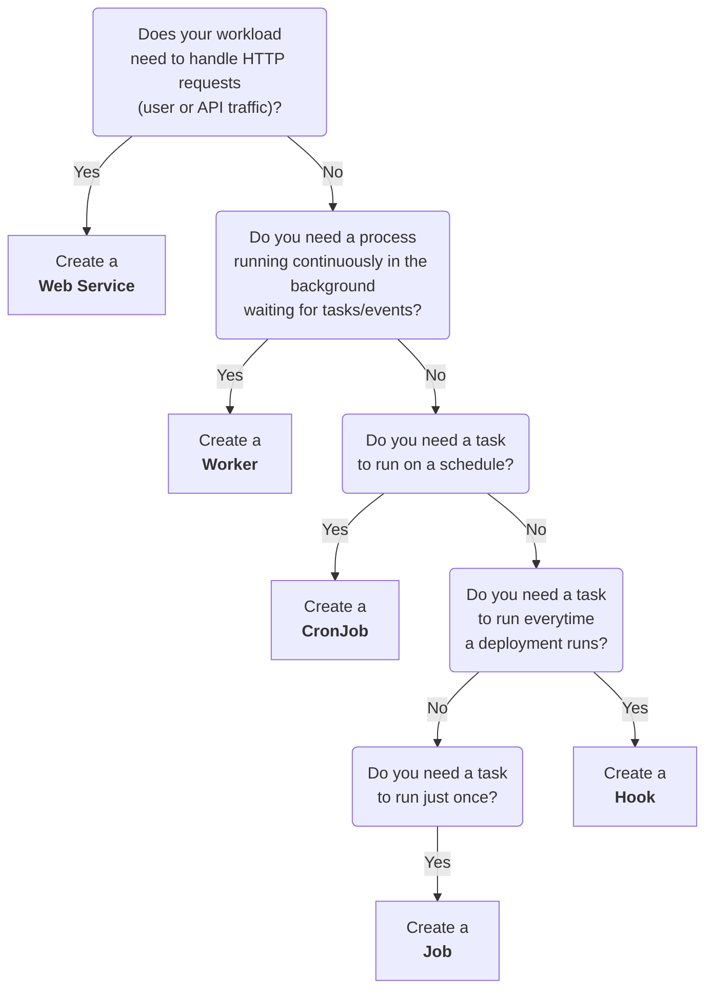

import { FiExternalLink, FiCornerRightDown } from "react-icons/fi";

# Workloads

In SleakOps, an Workload is simply a user-defined workload that runs within the cluster. Depending on how and when you need your workload to run, you can choose from five different types:

| Name | Description |
| ------ | ----------- |
| [Web Service](/docs/project/workload/webservice) | An always-on service that handles HTTP requests (e.g., hosting websites, APIs). |
| [Worker](/docs/project/workload/worker) |	A background process for internal tasks (e.g., message queues, data processing). |
| [Cronjob](/docs/project/workload/cronjob) |	A scheduled job that runs periodically (e.g., daily at 3 a.m.). |
| [Job](/docs/project/workload/job) |	A one-time task, ideal for ad-hoc or maintenance operations. |
| [Hook](/docs/project/workload/hook) | A task triggered by deployment events (e.g., run database migrations or collect statistics). |

## Which workload type is right for me?

- **Web Service:** Choose this if you need your application or service to be available 24/7 to respond to HTTP requests.
- **Worker:** Use this for background processing tasks, such as message queues or data pipelines, with no direct HTTP interaction.
- **CronJob:** Ideal for recurring maintenance or reporting tasks scheduled at specific times.
- **Job:** Suitable for one-time or on-demand tasks (e.g., manual database migrations).
- **Hook:** Perfect if you want to automate certain actions (like database migrations or analytics) on every deployment.

## FAQs

### What are CPU and Memory Requests and Limits, and what are the defaults?

When configuring any workload in SleakOps (Web Service, Worker, CronJob, Job, or Hook), you can define resource **requests** and **limits** for both CPU and memory:

- **Min/Request**: The minimum amount of resources guaranteed to your workload. Kubernetes uses this value to schedule your workload on a node with sufficient available resources.
- **Max/Limit**: The maximum amount of resources your workload can consume. If your workload exceeds this limit, it may be throttled (CPU) or terminated (memory).

**SleakOps Default Behavior:**

When you create a workload and specify **Request** values but **do not specify Limit** values, SleakOps automatically sets the limits to **130% of the request values**.

For example:
- If you set **CPU Request** to `1000m` (1 CPU core) without specifying a limit, SleakOps will automatically set **CPU Limit** to `1300m` (1.3 CPU cores)
- If you set **Memory Request** to `512Mi` without specifying a limit, SleakOps will automatically set **Memory Limit** to `665Mi` (approximately 130%)

**Overriding the Default:**

You can override this automatic 130% limit by explicitly setting your own **CPU Limit** and **Memory Limit** values in the workload configuration form. When you specify custom limits, SleakOps will use your values instead of the automatic 130% calculation.

This gives you full control over resource allocation while providing sensible defaults for quick deployments.

