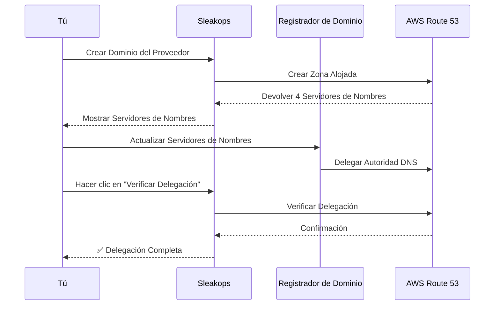
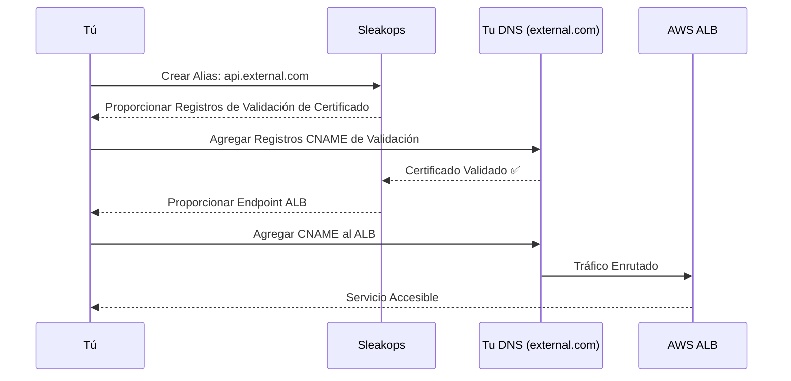
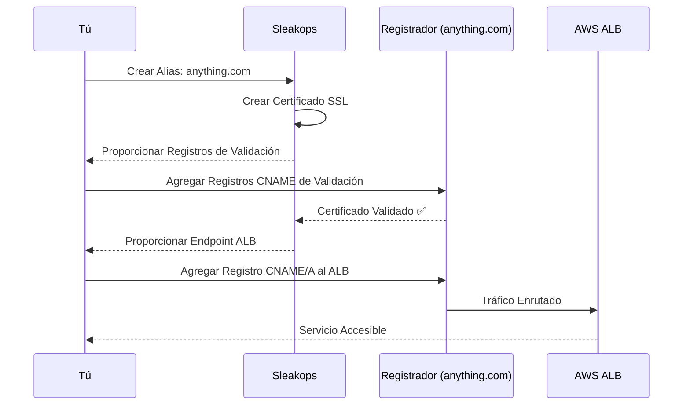

# Guía de Delegación de Dominios

Aprende cómo delegar DNS correctamente para cada nivel de dominio en Sleakops.

---

## Descripción General

Cuando Sleakops crea una zona alojada, necesitas delegar el dominio actualizando los registros DNS en tu proveedor de dominios (registrador). Esta guía explica el proceso para cada nivel de dominio.

---

## Delegación de Dominio del Proveedor

### Qué estás delegando
Tu dominio raíz (por ejemplo, `sleakops.com`) a AWS Route 53 a través de Sleakops.



### Pasos

1. **Crear el dominio del Proveedor en Sleakops**
   - Sleakops crea una zona alojada en AWS Route 53
   - Verás una tabla con 4 registros de servidor de nombres (NS)

2. **Localizar los servidores de nombres**

```
ns-123.awsdns-12.com
ns-456.awsdns-45.net
ns-789.awsdns-78.org
ns-012.awsdns-01.co.uk
```


3. **Actualizar tu registrador de dominio**
   - Inicia sesión en tu registrador de dominio (GoDaddy, Namecheap, Google Domains, etc.)
   - Busca la configuración DNS o de Servidores de nombres
   - Reemplaza los servidores de nombres existentes con los 4 servidores de nombres de AWS de Sleakops
   - Guardar cambios

4. **Verificar delegación**
   - Hacer clic en el botón **"Verificar Delegación"** en Sleakops
   - Esperar la propagación DNS (puede tomar hasta 48 horas, usualmente más rápido)
   - La marca verde indica delegación exitosa

### Registradores Comunes

<details>
<summary><strong>GoDaddy</strong></summary>

1. Ve a [Administrador de Dominios](https://account.godaddy.com/products)
2. Haz clic en tu dominio
3. Desplázate hasta "Servidores de nombres" → Haz clic en "Cambiar"
4. Selecciona "Ingresar mis propios servidores de nombres (avanzado)"
5. Agrega los 4 servidores de nombres de AWS
6. Guardar

</details>

<details>
<summary><strong>Namecheap</strong></summary>

1. Ve a [Lista de Dominios](https://ap.www.namecheap.com/domains/list/)
2. Haz clic en "Administrar" junto a tu dominio
3. Selecciona "DNS Personalizado" bajo Servidores de nombres
4. Agrega los 4 servidores de nombres de AWS
5. Haz clic en la marca verde

</details>

<details>
<summary><strong>Cloudflare</strong></summary>

**Nota:** Si usas Cloudflare, debes deshabilitar el proxy de Cloudflare para una delegación adecuada.

1. Remover el dominio de Cloudflare, O
2. Actualizar servidores de nombres a AWS (elimina la gestión DNS de Cloudflare)

</details>

---

## Delegación de Dominio del Entorno

### Qué estás delegando
Un subdominio (por ejemplo, `qa.sleakops.com`) a su propia zona alojada.


### Dos Escenarios

#### Escenario A: El dominio padre ES administrado por Sleakops

```mermaid
graph LR
    A[sleakops.com<br/>en Sleakops] --> B[qa.sleakops.com<br/>en Sleakops]
    B --> C[✅ Delegación<br/>Automática]
    
    style A fill:#201f1f,stroke:#90cdf4,stroke-width:2px
    style B fill:#340f09,stroke:#594440,stroke-width:2px
    style C fill:#1a202c,stroke:#2e7d32,stroke-width:2px
```



**¡Buenas noticias!** Sleakops crea automáticamente los registros NS en la zona alojada padre.

✅ **No se requiere acción** - la delegación es automática

---

#### Escenario B: El dominio padre NO es administrado por Sleakops

```mermaid
graph LR
    A[sleakops.com<br/>DNS Externo] -.-> B[qa.sleakops.com<br/>en Sleakops]
    B --> C[⚠️ Registros NS<br/>Manuales Requeridos]
    
    style A fill:#594440,stroke:#c62828,stroke-width:2px
    style B fill:#340f09,stroke:#594440,stroke-width:2px
    style C fill:#1f2020,stroke:#e65100,stroke-width:2px
```



Si `sleakops.com` se administra fuera de Sleakops, pero quieres `qa.sleakops.com` en Sleakops:

1. **Crear el dominio del Entorno en Sleakops**
   - Sleakops crea una zona alojada
   - Verás 4 registros de servidor de nombres

2. **Agregar registros NS al dominio padre**
   - Ve a donde se administra el DNS de `sleakops.com` (registrador, Cloudflare, etc.)
   - Crear 4 registros NS para el subdominio:

```
Tipo de Registro: NS
Nombre: qa
Valor: ns-123.awsdns-12.com
Tipo de Registro: NS
Nombre: qa
Valor: ns-456.awsdns-45.net
(repetir para los 4 servidores de nombres)
```

3. **Verificar delegación**
   - Hacer clic en **"Verificar Delegación"** en Sleakops
   - Esperar la propagación DNS (usualmente 5-30 minutos)

---

## Configuración de Dominio del Webservice

### Qué sucede
Los dominios de webservice (por ejemplo, `api.qa.sleakops.com`) se **configuran automáticamente**.

```mermaid
graph LR
    A[Desplegar Webservice] --> B[Sleakops Crea<br/>Registro CNAME]
    B --> C[Apunta al ALB]
    C --> D[✅ Listo para Usar]
    
    style A fill:#1a202c,stroke:#f2f2f2,stroke-width:2px
    style B fill:#1a202c,stroke:#2e7d32,stroke-width:2px
    style C fill:#1a202c,stroke:#2e7d32,stroke-width:2px
    style D fill:#1a202c,stroke:#90cdf4,stroke-width:3px
```




✅ **No se necesita delegación** - Sleakops automáticamente:
- Crea registro CNAME en la zona alojada del entorno
- Apunta al Application Load Balancer (ALB)
- Configura certificado SSL

**¡No necesitas hacer nada!**

---

## Configuración de Dominio Alias

Los dominios alias requieren configuración DNS manual en tu proveedor de dominio.

### Escenario A: El alias coincide con una zona alojada existente

**Ejemplo:** Tu alias es `api.external.com` y ya tienes `external.com` como Proveedor o Entorno en Sleakops.



#### Para Validación de Certificado SSL

1. **Sleakops proporciona registros de validación**
   - Verás registros CNAME para validación de certificado
   - Ejemplo:

```
_acme-challenge.api.external.com → _validation123.acme.aws.com
```

2. **Agregar registros de validación a tu DNS**
   - Ve a la zona alojada de `external.com` (en Sleakops o donde sea que se administre)
   - Agrega los registros CNAME exactamente como se muestra
   - Esperar validación del certificado (usualmente 5-15 minutos)

#### Para Enrutamiento de Tráfico

3. **Sleakops proporciona endpoint ALB**
   - Verás el nombre DNS del ALB:

```
ALB: my-alb-123456.us-east-1.elb.amazonaws.com
```

4. **Crear registro CNAME**
   - Ve a tu administración DNS para `external.com`
   - Crear un registro CNAME:

```
Tipo de Registro: CNAME
Nombre: api
Valor: my-alb-123456.us-east-1.elb.amazonaws.com
TTL: 300
```

5. **Verificar**
   - Probar el dominio: `curl https://api.external.com`
   - Debería devolver la respuesta de tu servicio

---

### Escenario B: El alias no coincide con ninguna zona alojada

**Ejemplo:** Tu alias es `anything.com` y este dominio no se administra en Sleakops.




#### Para Certificado SSL

1. **Sleakops crea certificado SSL**
   - Se proporcionan registros de validación de certificado
   - Ejemplo:

```
_acme-challenge.anything.com → _validation456.acme.aws.com
```

2. **Agregar registros de validación**
   - Inicia sesión en tu proveedor de dominio para `anything.com`
   - Agregar los registros CNAME para validación de certificado
   - Esperar validación (5-15 minutos)

#### Para Enrutamiento de Tráfico

3. **Sleakops proporciona endpoint ALB**

```
ALB: my-alb-789012.us-east-1.elb.amazonaws.com
```

4. **Configurar DNS en tu proveedor**

    **Opción 1: CNAME (para subdominios)**

```
Tipo de Registro: CNAME
Nombre: www (o subdominio)
Valor: my-alb-789012.us-east-1.elb.amazonaws.com
```

   **Opción 2: Registro A con ALIAS (para dominio raíz)**
   - Algunos proveedores soportan registros ALIAS (Route 53, Cloudflare)

```
Tipo de Registro: A (ALIAS)
Nombre: @ (raíz)
Valor: my-alb-789012.us-east-1.elb.amazonaws.com
```

   **Opción 3: Registro A con IP (no recomendado)**
   - Buscar IPs del ALB y crear registros A
   - ⚠️ Las IPs pueden cambiar - usa CNAME cuando sea posible

5. **Verificar**
   - Probar: `curl https://anything.com`
   - Asegurar que el certificado SSL sea válido

---

## Lista de Verificación

### Dominio Proveedor/Entorno
- [ ] Servidores de nombres actualizados en el registrador
- [ ] "Verificar Delegación" botón muestra éxito
- [ ] La búsqueda DNS devuelve servidores de nombres correctos: `dig NS tudominio.com`

### Dominio Webservice
- [ ] Webservice desplegado y funcionando
- [ ] Dominio resuelve: `curl https://api.qa.sleakops.com`
- [ ] Certificado SSL válido (sin advertencias del navegador)
- [ ] La búsqueda DNS devuelve CNAME correcto: `dig CNAME api.qa.sleakops.com`

### Dominio Alias
- [ ] Registros de validación de certificado agregados
- [ ] Certificado muestra como validado en Sleakops
- [ ] Registro CNAME/A apunta al ALB
- [ ] Dominio resuelve: `curl https://tu-alias.com`
- [ ] La búsqueda DNS devuelve CNAME correcto: `dig CNAME tu-alias.com`
- [ ] Certificado SSL válido

---

## Resolución de Problemas

### "Verificar Delegación" falla

```mermaid
graph TD
    A[Verificación de Delegación Falla] --> B{¿Todos los 4 Servidores de Nombres Agregados?}
    B -->|No| C[Agregar Servidores de Nombres Faltantes]
    B -->|Sí| D{¿Algún Error Tipográfico?}
    D -->|Sí| E[Corregir Errores Tipográficos]
    D -->|No| F{¿Guardado en el Registrador?}
    F -->|No| G[Guardar Cambios]
    F -->|Sí| H[Esperar Propagación<br/>hasta 48 horas]
    
    C --> I[Intentar de Nuevo]
    E --> I
    G --> I
    H --> I
    
    style A fill:#594440,stroke:#c62828,stroke-width:2px
    style I fill:#1a202c,stroke:#f2f2f2,stroke-width:2px
```



**Problema:** Servidores de nombres no delegados correctamente

**Soluciones:**
1. Verificar que agregaste TODOS los 4 servidores de nombres
2. Revisar errores tipográficos en los valores de los servidores de nombres
3. Esperar más tiempo (la propagación DNS puede tomar hasta 48 horas)
4. Limpiar caché DNS: `dig @8.8.8.8 tudominio.com`
5. Verificar en el registrador que los cambios fueron guardados

---

### Validación de certificado atascada

**Problema:** Certificado SSL no se valida

**Soluciones:**
1. Verificar que los registros CNAME se agregaron correctamente (sin puntos extra, valores correctos)
2. Revisar que el TTL no haya expirado
3. Remover cualquier registro DNS en conflicto
4. Esperar 15-30 minutos para propagación DNS
5. Revisar DNS: `dig _acme-challenge.tudominio.com`

---

### Dominio no resuelve

**Problema:** El dominio no carga tu servicio

**Soluciones:**
1. Verificar que el registro CNAME/A apunte al endpoint ALB correcto
2. Revisar que el ALB esté saludable y recibiendo tráfico
3. Verificar que el webservice esté desplegado y funcionando
4. Probar con `curl -v https://tudominio.com` para errores detallados
5. Revisar que los grupos de seguridad permitan tráfico en el puerto 443

---

### Errores de certificado SSL en el navegador

**Problema:** El navegador muestra "No Seguro" o advertencias de certificado

**Soluciones:**
1. Verificar que el certificado esté validado en Sleakops
2. Revisar que el certificado incluya tu nombre de dominio
3. Limpiar caché del navegador
4. Verificar que el certificado correcto esté adjunto al listener del ALB
5. Revisar que el certificado no haya expirado

---

## Tiempo de Propagación DNS

| Tipo de Cambio | Tiempo Típico | Tiempo Máximo |
|-----------------|---------------|---------------|
| Actualización de servidor de nombres | 15-30 minutos | 48 horas |
| Registro CNAME | 5-15 minutos | 24 horas |
| Registro A | 5-15 minutos | 24 horas |
| Validación de certificado | 5-15 minutos | 30 minutos |

💡 **Consejo:** Usa `https://dnschecker.org` para verificar la propagación DNS globalmente

---

## ¿Necesitas Ayuda?

- Revisa [Niveles de Dominio y Estrategias](/docs/domain/)
- Contacta al soporte de Sleakops con los detalles de configuración de tu dominio