# Niveles de Dominio y Estrategias

Sleakops proporciona una arquitectura de dominios flexible con tres niveles jerárquicos, además de alias personalizados para casos de uso avanzados.

## Descripción General

```mermaid
graph TD
    A[Dominio del Proveedor<br/>miempresa.com] --> B[Dominio del Entorno<br/>qa.miempresa.com]
    A --> C[Dominio del Entorno<br/>prod.miempresa.com]
    B --> D[Webservice<br/>api.qa.miempresa.com]
    B --> E[Webservice<br/>web.qa.miempresa.com]
    C --> F[Webservice<br/>api.prod.miempresa.com]
    D -.-> G[Alias<br/>api.miempresa.org]
    D -.-> H[Alias<br/>dominio.personalizado.com]
    
    style A fill:#201f1f,stroke:#90cdf4,stroke-width:2px
    style B fill:#340f09,stroke:#594440,stroke-width:2px
    style C fill:#340f09,stroke:#594440,stroke-width:2px
    style D fill:#1a202c,stroke:#f2f2f2,stroke-width:2px
    style E fill:#1a202c,stroke:#f2f2f2,stroke-width:2px
    style F fill:#1a202c,stroke:#f2f2f2,stroke-width:2px
    style G fill:#1f2020,stroke:#e65100,stroke-width:2px,stroke-dasharray: 5 5
    style H fill:#1f2020,stroke:#e65100,stroke-width:2px,stroke-dasharray: 5 5
```

---

## 1. Dominio del Proveedor (Nivel Raíz)

**Qué es:** El dominio raíz de tu organización.

**Ejemplo:** `sleakops.com`

**Lo que Sleakops crea:**
- ✅ Zona Alojada de AWS
- ✅ Certificado SSL

**Caso de uso:** 
Establece la infraestructura principal de tu dominio. Todos los entornos y servicios se organizarán bajo este dominio.

**Cuándo usarlo:**
- Configurando Sleakops por primera vez
- Gestionando el dominio principal de tu organización

---

## 2. Dominio del Entorno (Nivel de Subdominio)

**Qué es:** Subdominios que representan diferentes entornos.

**Ejemplos:** 
- `qa.sleakops.com`
- `staging.sleakops.com`
- `prod.sleakops.com`

**Lo que Sleakops crea:**
- ✅ Zona Alojada de AWS
- ✅ Certificado SSL

**Caso de uso:**
Aislar y organizar tus entornos de despliegue. Cada entorno obtiene su propio subdominio con gestión DNS independiente.

**Cuándo usarlo:**
- Crear entornos separados (desarrollo, staging, producción)
- Aislar equipos o proyectos
- Gestionar múltiples etapas de despliegue

---

## 3. Dominio del Webservice (Auto-generado)

**Qué es:** Asignación automática de dominio para cada webservice.

**Patrón:** `[nombre-webservice].[dominio-entorno]`

**Ejemplo:** 
- Nombre del webservice: `api`
- Entorno: `qa.sleakops.com`
- **Resultado:** `api.qa.sleakops.com`

**Lo que Sleakops crea:**
- ✅ Registro CNAME (agregado automáticamente a la zona alojada del entorno)
- ✅ Apunta al Application Load Balancer (ALB)

**Caso de uso:**
Configuración de dominio sin configuración. Cada servicio obtiene automáticamente un dominio jerárquico y predecible.

**Cuándo usarlo:**
- Escenario predeterminado para todos los webservices
- Cuando quieres URLs consistentes y predecibles
- Despliegues rápidos sin configuración de dominio personalizada

---

## 4. Dominios Alias (Nivel Personalizado)

**Qué es:** Dominios personalizados fuera de tu jerarquía estándar.

**Ejemplos:**
- `api.dominio-externo.com`
- `www.miempresa.io`
- `cualquiera.com`

**Lo que hace Sleakops:**

### Escenario A: El dominio coincide con una zona alojada existente
Si `dominio-externo.com` ya es un Proveedor o Entorno en Sleakops:
- ✅ Proporciona registros DNS para validación de certificado SSL
- ✅ Proporciona nombre ALB para configuración DNS
- ⚠️ Tú configuras los registros DNS por tu cuenta

### Escenario B: El dominio no coincide con ninguna zona alojada
Si `cualquiera.com` es completamente externo:
- ✅ Crea certificado SSL
- ✅ Proporciona registros de validación para el certificado
- ✅ Proporciona nombre ALB para configuración DNS
- ⚠️ Tú gestionas el DNS en tu proveedor de dominios

**Caso de uso:**
- Dominios de marca personalizados
- Dominios externos apuntando a tus servicios
- URLs de marketing o vanidad
- Servicios multi-dominio

**Cuándo usarlo:**
- El dominio predeterminado del webservice no se ajusta a tus necesidades
- Necesitas múltiples dominios para el mismo servicio
- Conectar dominios externos a tus servicios de Sleakops

---

## Estrategias de Delegación

Sleakops ofrece tres enfoques de delegación, dándote flexibilidad basada en tus necesidades de infraestructura y políticas organizacionales.

### Estrategia A: Delegación Completa (Recomendada)

Delegar el Proveedor (dominio raíz) y dejar que Sleakops gestione todo

```mermaid
graph TD
    A[sleakops.com<br/>🔑 Delegado a Sleakops] --> B[prod.sleakops.com<br/>✅ Auto-gestionado]
    A --> C[qa.sleakops.com<br/>✅ Auto-gestionado]
    B --> D[api.prod.sleakops.com<br/>✅ Auto-gestionado]
    B --> E[web.prod.sleakops.com<br/>✅ Auto-gestionado]
    C --> F[api.qa.sleakops.com<br/>✅ Auto-gestionado]
    
    style A fill:#1a202c,stroke:#2e7d32,stroke-width:3px
    style B fill:#1a202c,stroke:#388e3c,stroke-width:2px
    style C fill:#1a202c,stroke:#388e3c,stroke-width:2px
    style D fill:#1a202c,stroke:#43a047,stroke-width:2px
    style E fill:#1a202c,stroke:#43a047,stroke-width:2px
    style F fill:#1a202c,stroke:#43a047,stroke-width:2px
```

#### Lo que delegas:

Servidores de nombres del dominio del Proveedor a AWS Route 53

**Lo que Sleakops gestiona automáticamente:**

- ✅ Todos los dominios del entorno (zonas alojadas + certificados SSL)
- ✅ Todos los dominios de webservice (registros CNAME + enrutamiento)
- ✅ Propagación DNS y validación
- ✅ Ciclo de vida completo del certificado SSL

**Beneficios:**

- 🚀 Configuración DNS cero después de la delegación inicial
- 🔒 Gestión automatizada de certificados SSL
- 🎯 Infraestructura completamente gestionada
- ⚡ Experiencia de despliegue más rápida

**Mejor para:**

- Nuevos proyectos empezando desde cero
- Equipos que quieren mínima sobrecarga DNS
- Organizaciones que adoptan soluciones completamente gestionadas
- Startups y equipos que se mueven rápido

**Configuración:**

Delegar tu dominio raíz (ej., sleakops.com) a Sleakops
Todo lo demás es automático

---

### Estrategia B: Delegación Por Entorno

Delegar dominios de entorno individuales mientras mantienes el control del dominio raíz

```mermaid
graph TD
    A[sleakops.com<br/>👤 Tú Controlas] -.-> B[prod.sleakops.com<br/>🔑 Delegado a Sleakops]
    A -.-> C[qa.sleakops.com<br/>🔑 Delegado a Sleakops]
    B --> D[api.prod.sleakops.com<br/>✅ Auto-gestionado]
    B --> E[web.prod.sleakops.com<br/>✅ Auto-gestionado]
    C --> F[api.qa.sleakops.com<br/>✅ Auto-gestionado]
    
    style A fill:#1a202c,stroke:#e65100,stroke-width:3px
    style B fill:#1a202c,stroke:#2e7d32,stroke-width:3px
    style C fill:#1a202c,stroke:#2e7d32,stroke-width:3px
    style D fill:#1a202c,stroke:#43a047,stroke-width:2px
    style E fill:#1a202c,stroke:#43a047,stroke-width:2px
    style F fill:#1a202c,stroke:#43a047,stroke-width:2px
```

#### Lo que delegas:

Servidores de nombres de dominios de entorno individuales (ej., qa.sleakops.com, prod.sleakops.com)

**Lo que Sleakops gestiona automáticamente:**

- ✅ Todos los dominios de webservice dentro de entornos delegados
- ✅ Certificados SSL para entornos delegados
- ✅ Registros DNS dentro de zonas delegadas

**Lo que tú gestionas:**

- ⚙️ DNS del dominio raíz
- ⚙️ Registros NS apuntando a cada entorno

**Beneficios:**

- 🎛️ Control del dominio raíz para otros propósitos (email, sitios de marketing, etc.)
- 🔒 Gestión aislada de entornos
- ✅ DNS automático de webservice dentro de cada entorno
- 🏢 Cumplimiento con políticas DNS organizacionales

**Mejor para:**

- Organizaciones con infraestructura de dominio raíz existente
- Equipos que necesitan dominio raíz para servicios no-Sleakops
- Migración gradual a Sleakops
- Organizaciones multi-equipo con aislamiento a nivel de entorno

**Configuración:**

Mantener tu dominio raíz (ej., sleakops.com) gestionado externamente
Delegar cada entorno (ej., qa.sleakops.com) a Sleakops
Agregar registros NS en tu DNS de dominio raíz para cada entorno

---

### Estrategia C: Control Completo (Gestión Manual)
Retener control DNS completo y configurar manualmente todos los registros

```mermaid
graph TD
    A[sleakops.com<br/>👤 Tú Controlas] -.-> B[prod.sleakops.com<br/>👤 Tú Controlas]
    A -.-> C[qa.sleakops.com<br/>👤 Tú Controlas]
    B -.-> D[api.prod.sleakops.com<br/>⚙️ CNAME Manual]
    B -.-> E[web.prod.sleakops.com<br/>⚙️ CNAME Manual]
    C -.-> F[api.qa.sleakops.com<br/>⚙️ CNAME Manual]
    
    style A fill:#1a202c,stroke:#c62828,stroke-width:3px
    style B fill:#1a202c,stroke:#d84315,stroke-width:2px
    style C fill:#1a202c,stroke:#d84315,stroke-width:2px
    style D fill:#1a202c,stroke:#e64a19,stroke-width:2px
    style E fill:#1a202c,stroke:#e64a19,stroke-width:2px
    style F fill:#1a202c,stroke:#e64a19,stroke-width:2px
```

#### Lo que delegas:

Nada - tú gestionas todo el DNS

**Lo que Sleakops proporciona:**

- 📋 Registros DNS para validación de certificado SSL
- 📋 Endpoints ALB para enrutamiento de tráfico

**Lo que tú gestionas:**

- ⚙️ Todas las zonas DNS y registros
- ⚙️ Registros de validación de certificados
- ⚙️ Registros CNAME apuntando al ALB
- ⚙️ Todas las actualizaciones y cambios DNS

**Beneficios:**

- 🎛️ Control completo de infraestructura DNS
- 🔐 Mantener DNS dentro de límites de seguridad existentes
- 📊 Integración con monitoreo DNS existente
- 🏢 Cumplir requisitos estrictos de cumplimiento

**Mejor para:**

- Organizaciones con gobernanza DNS estricta
- Infraestructura DNS compleja existente
- Políticas de seguridad que requieren aislamiento DNS
- Empresas con equipos DNS dedicados

**Configuración:**

Crear dominios en Sleakops (sin delegación)
Sleakops proporciona registros de validación y endpoints ALB
Agregar manualmente todos los registros DNS requeridos en tu proveedor DNS

---

### Comparación de Estrategias de Delegación

| Aspecto | Delegación Completa | Por Entorno | Control Completo |
|---------|-------------------|-------------|------------------|
| Complejidad de Configuración | ⭐ Más Fácil | ⭐⭐ Moderada | ⭐⭐⭐ Compleja |
| Mantenimiento Continuo | ⭐ Ninguno | ⭐⭐ Mínimo | ⭐⭐⭐ Alto |
| Flexibilidad | ⭐⭐ Limitada | ⭐⭐⭐ Equilibrada | ⭐⭐⭐⭐ Máxima |
| Tiempo de Despliegue | ⚡ Instantáneo | ⚡⚡ Minutos | ⚡⚡⚡ Manual |
| Control DNS | Sleakops | Compartido | Tú |
| Mejor para Equipos | Pequeño-Mediano | Mediano-Grande | Empresarial |

---

## Patrones de Organización de Dominios

### Patrón 1: Jerarquía Estándar (Funciona con cualquier estrategia de delegación)

```mermaid
graph TD
    A[sleakops.com<br/>Proveedor] --> B[prod.sleakops.com<br/>Entorno]
    A --> C[staging.sleakops.com<br/>Entorno]
    B --> D[api.prod.sleakops.com<br/>Webservice]
    B --> E[web.prod.sleakops.com<br/>Webservice]
    C --> F[api.staging.sleakops.com<br/>Webservice]
    C --> G[web.staging.sleakops.com<br/>Webservice]
    
    style A fill:#201f1f,stroke:#90cdf4,stroke-width:2px
    style B fill:#340f09,stroke:#594440,stroke-width:2px
    style C fill:#340f09,stroke:#594440,stroke-width:2px
    style D fill:#1a202c,stroke:#f2f2f2,stroke-width:2px
    style E fill:#1a202c,stroke:#f2f2f2,stroke-width:2px
    style F fill:#1a202c,stroke:#f2f2f2,stroke-width:2px
    style G fill:#1a202c,stroke:#f2f2f2,stroke-width:2px
```

**Beneficios:**
- Separación clara de entornos
- Fácil de entender y gestionar
- SSL y DNS automáticos

---

### Patrón 2: Jerarquía Mixta con Dominios Personalizados

```mermaid
graph TD
    A[sleakops.com<br/>Proveedor] --> B[prod.sleakops.com<br/>Entorno]
    B --> C[api.prod.sleakops.com<br/>Webservice]
    C -.-> D[api.miempresa.com<br/>Alias]
    C -.-> E[api.dominio-cliente.com<br/>Alias]
    
    style A fill:#201f1f,stroke:#90cdf4,stroke-width:2px
    style B fill:#340f09,stroke:#594440,stroke-width:2px
    style C fill:#1a202c,stroke:#f2f2f2,stroke-width:2px
    style D fill:#1f2020,stroke:#e65100,stroke-width:2px,stroke-dasharray: 5 5
    style E fill:#1f2020,stroke:#e65100,stroke-width:2px,stroke-dasharray: 5 5
```

**Beneficios:**
- Dominios profesionales cara al cliente
- Mantiene estructura interna
- Flexibilidad para etiquetado blanco
- Requiere DNS manual para alias (todas las estrategias)

---

### Patrón 3: Entorno por Equipo/Proyecto

```mermaid
graph TD
    A[sleakops.com<br/>Proveedor] --> B[equipo-frontend.sleakops.com<br/>Entorno]
    A --> C[equipo-backend.sleakops.com<br/>Entorno]
    A --> D[equipo-datos.sleakops.com<br/>Entorno]
    B --> E[app.equipo-frontend.sleakops.com<br/>Webservice]
    C --> F[api.equipo-backend.sleakops.com<br/>Webservice]
    D --> G[analytics.equipo-datos.sleakops.com<br/>Webservice]
    
    style A fill:#201f1f,stroke:#90cdf4,stroke-width:2px
    style B fill:#340f09,stroke:#594440,stroke-width:2px
    style C fill:#340f09,stroke:#594440,stroke-width:2px
    style D fill:#340f09,stroke:#594440,stroke-width:2px
    style E fill:#1a202c,stroke:#f2f2f2,stroke-width:2px
    style F fill:#1a202c,stroke:#f2f2f2,stroke-width:2px
    style G fill:#1a202c,stroke:#f2f2f2,stroke-width:2px
```

**Beneficios:**
- Propiedad clara del equipo
- Gestión DNS independiente por equipo
- Escalable para organizaciones grandes

---

## Guía de Decisión Rápida

| Necesidad | Estrategia Recomendada |
|-----------|------------------------|
| Configuración más rápida | Delegación Completa |
| Mantener raíz para email/otros servicios | Delegación Por Entorno |
| Máximo control DNS | Control Completo |
| Migración gradual | Delegación Por Entorno |
| Cumplimiento estricto | Control Completo |
| Proyecto nuevo | Delegación Completa |
| Empresa con equipo DNS | Control Completo o Por Entorno |

| Tarea | Herramienta |
|-------|-------------|
| Configuración inicial | Dominio del Proveedor |
| Crear nuevo entorno | Dominio del Entorno |
| Desplegar un servicio | Webservice (automático) |
| URL de marca personalizada | Dominio Alias |
| Integración de dominio externo | Dominio Alias |
| Solución de etiqueta blanca | Dominio Alias |

