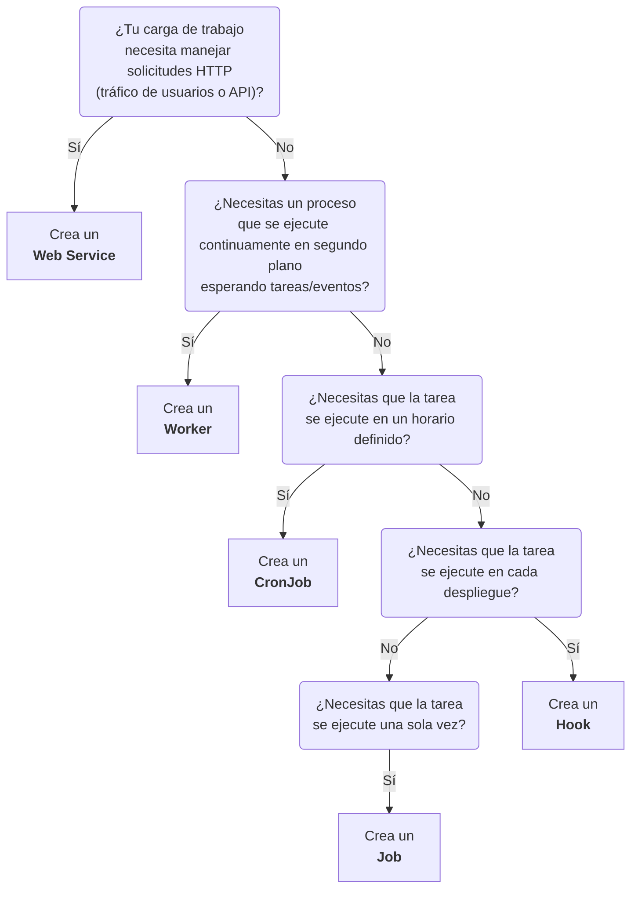

import { FiExternalLink, FiCornerRightDown } from "react-icons/fi";

# Workloads

En SleakOps, una Ejecución es simplemente un trabajo definido por el usuario que se ejecuta dentro del clúster. Dependiendo de cómo y cuándo necesites ejecutar tu carga de trabajo, puedes elegir entre cinco tipos diferentes:

| Name | Description |
| ------ | ----------- |
| [Web Service](/docs/project/workload/webservice) | Un servicio siempre activo que maneja solicitudes HTTP (por ejemplo, alojamiento de sitios web o APIs). |
| [Worker](/docs/project/workload/worker) |	Un proceso en segundo plano para tareas internas (por ejemplo, colas de mensajes, procesamiento de datos). |
| [Cronjob](/docs/project/workload/cronjob) |	Una tarea programada que se ejecuta periódicamente (por ejemplo, todos los días a las 3 a.m.). |
| [Job](/docs/project/workload/job) |	Una tarea de una sola ejecución, ideal para operaciones puntuales o de mantenimiento. |
| [Hook](/docs/project/workload/hook) | Una tarea que se activa cuando se produce un evento de despliegue (por ejemplo, para ejecutar migraciones de base de datos o recopilar estadísticas). |

## Cual workload deberia crear para mi aplicacion?

- **Web Service:** Elige esta opción si necesitas que tu aplicación o servicio esté disponible 24/7 para responder solicitudes HTTP.
- **Worker:** Úsalo para tareas de procesamiento en segundo plano, como colas de mensajes o procesos de datos, sin interacción HTTP directa.
- **CronJob:** Ideal para tareas de mantenimiento o generación de reportes que deban ejecutarse periódicamente en momentos específicos.
- **Job:** Adecuado para tareas puntuales o ejecutadas bajo demanda (por ejemplo, migraciones manuales de base de datos).
- **Hook:** Perfecto si quieres automatizar ciertas acciones (como migraciones de base de datos o análisis) en cada despliegue.

## FAQs

### ¿Qué son los Request y Limits de CPU y Memoria, y cuáles son los valores predeterminados?

Al configurar cualquier workload en SleakOps (Web Service, Worker, CronJob, Job o Hook), puedes definir **requests** (solicitudes) y **limits** (límites) de recursos tanto para CPU como para memoria:

- **Min/Request**: La cantidad mínima de recursos garantizada para tu workload. Kubernetes usa este valor para programar tu workload en un nodo con recursos disponibles suficientes.
- **Max/Limit**: La cantidad máxima de recursos que tu workload puede consumir. Si tu workload excede este límite, puede ser limitado (CPU) o terminado (memoria).

**Comportamiento Predeterminado de SleakOps:**

Cuando creas un workload y especificas valores de **Request** pero **no especificas valores de Limit**, SleakOps automáticamente establece los límites al **130% de los valores de request**.

Por ejemplo:
- Si estableces **CPU Request** en `1000m` (1 núcleo de CPU) sin especificar un límite, SleakOps establecerá automáticamente **CPU Limit** en `1300m` (1.3 núcleos de CPU)
- Si estableces **Memory Request** en `512Mi` sin especificar un límite, SleakOps establecerá automáticamente **Memory Limit** en `665Mi` (aproximadamente 130%)

**Sobrescribir el Valor Predeterminado:**

Puedes sobrescribir este límite automático del 130% estableciendo explícitamente tus propios valores de **CPU Limit** y **Memory Limit** en el formulario de configuración del workload. Cuando especificas límites personalizados, SleakOps usará tus valores en lugar del cálculo automático del 130%.

Esto te da control total sobre la asignación de recursos mientras proporciona valores predeterminados sensatos para despliegues rápidos.

