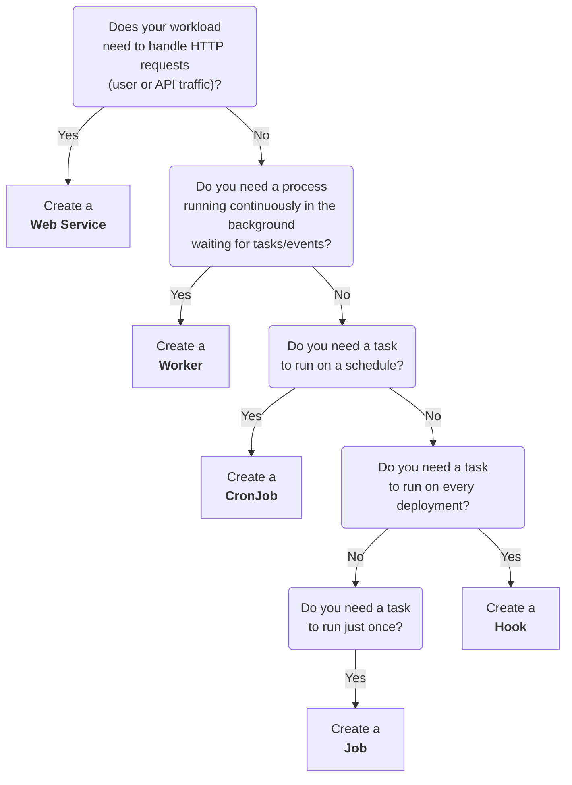

import { FiExternalLink, FiCornerRightDown } from "react-icons/fi";

# Executions

In SleakOps, an Execution is simply a user-defined workload that runs within the cluster. Depending on how and when you need your workload to run, you can choose from five different types:

| Name | Description |
| ------ | ----------- |
| [Web Service](/project/service/webservice) | An always-on service that handles HTTP requests (e.g., hosting websites, APIs). |
| [Worker](/project/service/worker) |	A background process for internal tasks (e.g., message queues, data processing). |
| [Cronjob](/project/service/cronjob) |	A scheduled job that runs periodically (e.g., daily at 3 a.m.). |
| [Job](/project/service/job) |	A one-time task, ideal for ad-hoc or maintenance operations. |
| [Hook](/project/service/hook) | A task triggered by deployment events (e.g., run database migrations or collect statistics). |

## Which execution type I choose?

- **Web Service:** Choose this if you need your application or service to be available 24/7 to respond to HTTP requests.
- **Worker:** Use this for background processing tasks, such as message queues or data pipelines, with no direct HTTP interaction.
- **CronJob:** Ideal for recurring maintenance or reporting tasks scheduled at specific times.
- **Job:** Suitable for one-time or on-demand tasks (e.g., manual database migrations).
- **Hook:** Perfect if you want to automate certain actions (like database migrations or analytics) on every deployment.