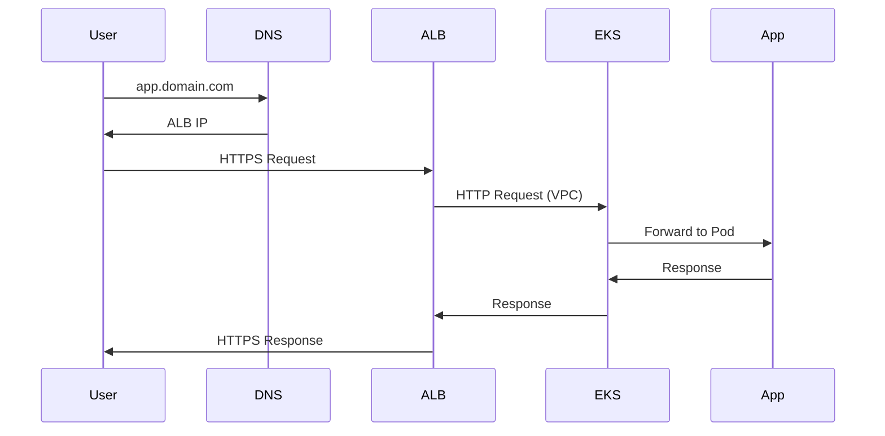

import TroubleshootingItem from "@site/src/components/HomepageFeatures/troubleshootingitem";

# Infrastructure Architecture Diagrams

**Date:** January 15, 2024  
**Category:** General  
**Tags:** Architecture, Infrastructure, Diagrams, Networking, VPC

## Problem Description

**Context:** Users need to understand the infrastructure architecture created by SleakOps when deploying applications, including how requests flow from users to applications and the relationship between different components.

**Observed Symptoms:**

- Lack of detailed infrastructure architecture diagrams
- Difficulty understanding request flow from browser to application
- Unclear component relationships within the VPC
- Generic diagrams that don't show real component details

**Relevant Configuration:**

- SleakOps deployed applications
- Load balancers and DNS configuration
- VPC and networking components
- Multiple application deployments

**Error Conditions:**

- Missing detailed architectural documentation
- Inadequate visual representation of infrastructure components
- Unclear boundaries between internal and external components

## Detailed Solution

<TroubleshootingItem id="architecture-overview" summary="SleakOps Infrastructure Architecture Overview">

SleakOps creates a comprehensive infrastructure architecture when deploying applications. Here's the typical architecture:

```
┌─────────────────────────────────────────────────────────────────┐
│                        Internet                                 │
└─────────────────────┬───────────────────────────────────────────┘
                      │
┌─────────────────────┴───────────────────────────────────────────┐
│                    DNS (Route 53)                              │
│  ┌─────────────────────────────────────────────────────────┐    │
│  │  app1.yourdomain.com → ALB                              │    │
│  │  app2.yourdomain.com → ALB                              │    │
│  └─────────────────────────────────────────────────────────┘    │
└─────────────────────┬───────────────────────────────────────────┘
                      │
┌─────────────────────┴───────────────────────────────────────────┐
│                Application Load Balancer (ALB)                 │
│  ┌─────────────────────────────────────────────────────────┐    │
│  │  SSL Termination                                        │    │
│  │  Path-based routing                                     │    │
│  │  Health checks                                          │    │
│  └─────────────────────────────────────────────────────────┘    │
└─────────────────────┬───────────────────────────────────────────┘
                      │
┌─────────────────────┴───────────────────────────────────────────┐
│                        VPC                                      │
│  ┌─────────────────────────────────────────────────────────┐    │
│  │              EKS Cluster                                │    │
│  │  ┌─────────────────┐  ┌─────────────────┐              │    │
│  │  │   Node Group 1  │  │   Node Group 2  │              │    │
│  │  │  ┌───────────┐  │  │  ┌───────────┐  │              │    │
│  │  │  │   Pod 1   │  │  │  │   Pod 3   │  │              │    │
│  │  │  │   Pod 2   │  │  │  │   Pod 4   │  │              │    │
│  │  │  └───────────┘  │  │  └───────────┘  │              │    │
│  │  └─────────────────┘  └─────────────────┘              │    │
│  └─────────────────────────────────────────────────────────┘    │
└─────────────────────────────────────────────────────────────────┘
```

</TroubleshootingItem>

<TroubleshootingItem id="request-flow" summary="Request Flow from Browser to Application">

Here's how a user request flows through the SleakOps infrastructure:

**1. DNS Resolution**

- User enters `app.yourdomain.com` in browser
- DNS (Route 53) resolves to Application Load Balancer IP

**2. Load Balancer Processing**

- Request hits ALB (outside VPC)
- SSL termination occurs at ALB
- ALB performs health checks on targets
- Routes request based on path/host rules

**3. VPC Entry**

- Request enters VPC through ALB target groups
- Traffic flows to EKS cluster nodes

**4. Kubernetes Processing**

- Request reaches Kubernetes Service
- Service load balances to healthy Pods
- Application processes the request

**5. Response Path**

- Application sends response back through same path
- ALB handles SSL encryption for response
- Response reaches user's browser



</TroubleshootingItem>

<TroubleshootingItem id="component-details" summary="Detailed Component Breakdown">

**Outside VPC:**

- **Route 53 DNS**: Domain name resolution
- **Application Load Balancer**: SSL termination, routing, health checks
- **Internet Gateway**: VPC internet access

**Inside VPC:**

- **EKS Cluster**: Managed Kubernetes control plane
- **Node Groups**: EC2 instances running Kubernetes nodes
- **Pods**: Application containers
- **Services**: Kubernetes load balancing
- **Ingress Controllers**: Route external traffic to services

**Networking Components:**

- **Public Subnets**: ALB and NAT Gateways
- **Private Subnets**: EKS nodes and Pods
- **Security Groups**: Firewall rules
- **NACLs**: Subnet-level access control

**Storage & Data:**

- **EBS Volumes**: Persistent storage for Pods
- **RDS/Database**: If configured
- **S3 Buckets**: Object storage

</TroubleshootingItem>

<TroubleshootingItem id="multi-app-architecture" summary="Multiple Applications Architecture">

When deploying multiple applications with SleakOps, the architecture scales efficiently:

```
┌─────────────────────────────────────────────────────────────────┐
│                    Application Load Balancer                   │
│  ┌─────────────────────────────────────────────────────────┐    │
│  │  Host-based routing:                                    │    │
│  │  • app1.domain.com → Target Group 1                    │    │
│  │  • app2.domain.com → Target Group 2                    │    │
│  │  • api.domain.com  → Target Group 3                    │    │
│  └─────────────────────────────────────────────────────────┘    │
└─────────────────────┬───────────────────────────────────────────┘
                      │
┌─────────────────────┴───────────────────────────────────────────┐
│                        VPC                                      │
│  ┌─────────────────────────────────────────────────────────┐    │
│  │                  EKS Cluster                            │    │
│  │                                                         │    │
│  │  ┌─────────────┐ ┌─────────────┐ ┌─────────────┐       │    │
│  │  │ Namespace 1 │ │ Namespace 2 │ │ Namespace 3 │       │    │
│  │  │             │ │             │ │             │       │    │
│  │  │ App1 Pods   │ │ App2 Pods   │ │ API Pods    │       │    │
│  │  │ Service     │ │ Service     │ │ Service     │       │    │
│  │  │ Ingress     │ │ Ingress     │ │ Ingress     │       │    │
│  │  └─────────────┘ └─────────────┘ └─────────────┘       │    │
│  └─────────────────────────────────────────────────────────┘    │
└─────────────────────────────────────────────────────────────────┘
```

**Key Benefits:**

- **Resource Sharing**: Multiple apps share the same EKS cluster
- **Isolation**: Each app runs in its own namespace
- **Efficient Routing**: Single ALB handles all applications
- **Cost Optimization**: Shared infrastructure reduces costs

</TroubleshootingItem>

<TroubleshootingItem id="security-architecture" summary="Security Architecture and Network Isolation">

SleakOps implements multiple layers of security:

**Network Security:**

```
┌─────────────────────────────────────────────────────────────────┐
│                      Internet                                   │
└─────────────────────┬───────────────────────────────────────────┘
                      │ (HTTPS only)
┌─────────────────────┴───────────────────────────────────────────┐
│                      ALB                                        │
│  Security Groups: Allow 80/443 from 0.0.0.0/0                 │
└─────────────────────┬───────────────────────────────────────────┘
                      │ (HTTP to VPC)
┌─────────────────────┴───────────────────────────────────────────┐
│                      VPC                                        │
│  ┌─────────────────────────────────────────────────────────┐    │
│  │              Private Subnets                            │    │
│  │  Security Groups: Allow traffic only from ALB          │    │
│  │  ┌─────────────────────────────────────────────────┐    │    │
│  │  │                EKS Nodes                        │    │    │
│  │  │  Pod Security: Network policies, RBAC          │    │    │
│  │  └─────────────────────────────────────────────────┘    │    │
│  └─────────────────────────────────────────────────────────┘    │
└─────────────────────────────────────────────────────────────────┘
```

**Security Layers:**

1. **SSL/TLS Termination**: All external traffic encrypted
2. **Security Groups**: Firewall rules at instance level
3. **Network ACLs**: Subnet-level access control
4. **Kubernetes RBAC**: Pod-level access control
5. **Network Policies**: Inter-pod communication rules

</TroubleshootingItem>

---

_This FAQ section was automatically generated on January 15, 2024, based on a real user inquiry._
