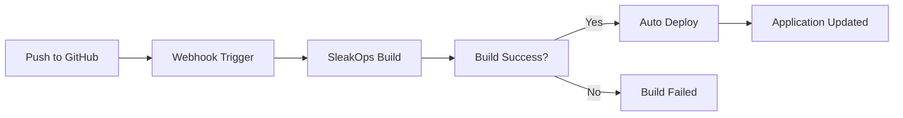

import TroubleshootingItem from "@site/src/components/HomepageFeatures/troubleshootingitem";

# Automatic Deployment Updates from GitHub

**Date:** August 2, 2024  
**Category:** Project  
**Tags:** Deployment, GitHub, CI/CD, Automation, Updates

## Problem Description

**Context:** User wants to understand how code changes pushed to their GitHub repository are automatically deployed to their SleakOps environment during testing phases.

**Observed Symptoms:**

- Uncertainty about whether code changes are automatically deployed
- Need to understand the deployment workflow
- Questions about manual intervention requirements
- Testing phase deployment concerns

**Relevant Configuration:**

- Source: GitHub repository
- Platform: SleakOps
- Environment: Development/Testing
- Domain: firev.com.ar

**Error Conditions:**

- Unclear deployment process
- Potential manual steps required
- Testing workflow uncertainty

## Detailed Solution

<TroubleshootingItem id="automatic-deployment" summary="How automatic deployments work in SleakOps">

SleakOps provides automatic deployment capabilities when properly configured:

**Default Behavior:**

- Code pushed to the connected branch triggers automatic builds
- Successful builds are automatically deployed to the target environment
- No manual intervention required in SleakOps dashboard

**Requirements:**

- GitHub repository must be properly connected to SleakOps
- Webhook configuration must be active
- Build configuration must be valid

</TroubleshootingItem>

<TroubleshootingItem id="verify-connection" summary="Verify GitHub integration">

To ensure your repository is properly connected:

1. **Check Repository Connection:**

   - Go to your Project in SleakOps
   - Navigate to **Settings** → **Repository**
   - Verify GitHub repository URL is correct
   - Check that webhook is active (green status)

2. **Verify Branch Configuration:**

   - Ensure the correct branch is selected for deployment
   - Common branches: `main`, `master`, `develop`

3. **Test the Connection:**
   - Make a small change to your repository
   - Push to the configured branch
   - Check SleakOps **Executions** tab for new build

</TroubleshootingItem>

<TroubleshootingItem id="deployment-workflow" summary="Understanding the deployment workflow">

The typical SleakOps deployment workflow:



**Steps:**

1. **Code Push**: Developer pushes code to GitHub
2. **Webhook Trigger**: GitHub notifies SleakOps of changes
3. **Build Process**: SleakOps builds the application
4. **Automatic Deployment**: If build succeeds, deployment happens automatically
5. **Live Update**: Application is updated with new code

</TroubleshootingItem>

<TroubleshootingItem id="testing-recommendations" summary="Best practices for testing deployments">

For testing phases, consider these practices:

**1. Use Development Environment:**

```yaml
# Recommended setup
Environments:
  - develop (for testing)
  - production (for live site)
```

**2. Branch Strategy:**

- Use `develop` branch for testing
- Use `main`/`master` for production
- Test changes in develop before merging to main

**3. Monitoring Deployments:**

- Check **Executions** tab after each push
- Monitor build logs for errors
- Verify application functionality after deployment

**4. Rollback Strategy:**

- Keep previous versions available
- Test rollback procedures
- Document known good states

</TroubleshootingItem>

<TroubleshootingItem id="troubleshooting" summary="Troubleshooting deployment issues">

If automatic deployments aren't working:

**1. Check Build Status:**

- Go to **Executions** tab
- Look for failed builds (red status)
- Review build logs for errors

**2. Verify Webhook:**

- Check GitHub repository settings
- Look for SleakOps webhook in **Settings** → **Webhooks**
- Ensure webhook is active and receiving payloads

**3. Branch Configuration:**

- Confirm you're pushing to the correct branch
- Verify branch name matches SleakOps configuration

**4. Build Configuration:**

- Check Dockerfile syntax
- Verify environment variables
- Ensure all dependencies are properly defined

</TroubleshootingItem>

<TroubleshootingItem id="manual-intervention" summary="When manual intervention is needed">

You may need manual action in these cases:

**1. Build Failures:**

- Fix code issues and push again
- Update build configuration if needed

**2. Environment Variables:**

- Update variables in SleakOps dashboard
- Restart executions if variables changed

**3. Infrastructure Changes:**

- Scaling requirements
- Resource limit adjustments
- New dependencies

**4. Domain Configuration:**

- DNS changes
- SSL certificate updates
- Custom domain setup

</TroubleshootingItem>

---

_This FAQ was automatically generated on August 2, 2024 based on a real user query._
