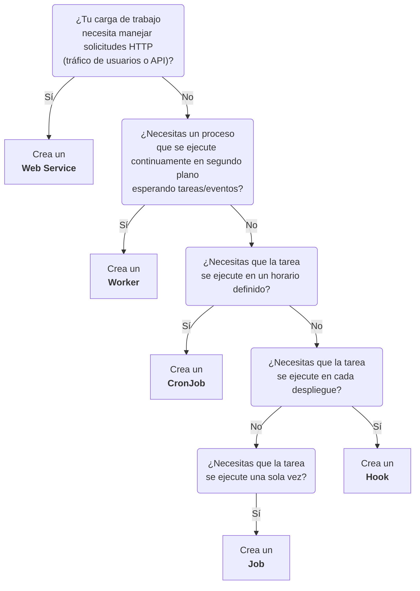

import { FiExternalLink, FiCornerRightDown } from "react-icons/fi";

# Workloads

En SleakOps, una Ejecución es simplemente un trabajo definido por el usuario que se ejecuta dentro del clúster. Dependiendo de cómo y cuándo necesites ejecutar tu carga de trabajo, puedes elegir entre cinco tipos diferentes:

| Name | Description |
| ------ | ----------- |
| [Web Service](/docs/project/workload/webservice) | Un servicio siempre activo que maneja solicitudes HTTP (por ejemplo, alojamiento de sitios web o APIs). |
| [Worker](/docs/project/workload/worker) |	Un proceso en segundo plano para tareas internas (por ejemplo, colas de mensajes, procesamiento de datos). |
| [Cronjob](/docs/project/workload/cronjob) |	Una tarea programada que se ejecuta periódicamente (por ejemplo, todos los días a las 3 a.m.). |
| [Job](/docs/project/workload/job) |	Una tarea de una sola ejecución, ideal para operaciones puntuales o de mantenimiento. |
| [Hook](/docs/project/workload/hook) | Una tarea que se activa cuando se produce un evento de despliegue (por ejemplo, para ejecutar migraciones de base de datos o recopilar estadísticas). |

## Cual workload deberia crear para mi aplicacion?

- **Web Service:** Elige esta opción si necesitas que tu aplicación o servicio esté disponible 24/7 para responder solicitudes HTTP.
- **Worker:** Úsalo para tareas de procesamiento en segundo plano, como colas de mensajes o procesos de datos, sin interacción HTTP directa.
- **CronJob:** Ideal para tareas de mantenimiento o generación de reportes que deban ejecutarse periódicamente en momentos específicos.
- **Job:** Adecuado para tareas puntuales o ejecutadas bajo demanda (por ejemplo, migraciones manuales de base de datos).
- **Hook:** Perfecto si quieres automatizar ciertas acciones (como migraciones de base de datos o análisis) en cada despliegue.