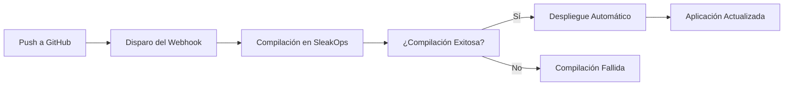

import TroubleshootingItem from "@site/src/components/HomepageFeatures/troubleshootingitem";

# Actualizaciones Automáticas de Despliegue desde GitHub

**Fecha:** 2 de agosto de 2024  
**Categoría:** Proyecto  
**Etiquetas:** Despliegue, GitHub, CI/CD, Automatización, Actualizaciones

## Descripción del Problema

**Contexto:** El usuario desea entender cómo los cambios de código enviados a su repositorio de GitHub se despliegan automáticamente en su entorno de SleakOps durante las fases de prueba.

**Síntomas Observados:**

- Incertidumbre sobre si los cambios de código se despliegan automáticamente
- Necesidad de comprender el flujo de trabajo de despliegue
- Preguntas sobre requisitos de intervención manual
- Preocupaciones sobre despliegues en fase de prueba

**Configuración Relevante:**

- Fuente: Repositorio de GitHub
- Plataforma: SleakOps
- Entorno: Desarrollo/Pruebas
- Dominio: firev.com.ar

**Condiciones de Error:**

- Proceso de despliegue poco claro
- Posibles pasos manuales requeridos
- Incertidumbre en flujo de trabajo de pruebas

## Solución Detallada

<TroubleshootingItem id="automatic-deployment" summary="Cómo funcionan los despliegues automáticos en SleakOps">

SleakOps ofrece capacidades de despliegue automático cuando está configurado correctamente:

**Comportamiento por Defecto:**

- El código enviado a la rama conectada dispara compilaciones automáticas
- Las compilaciones exitosas se despliegan automáticamente al entorno objetivo
- No se requiere intervención manual en el panel de SleakOps

**Requisitos:**

- El repositorio de GitHub debe estar correctamente conectado a SleakOps
- La configuración del webhook debe estar activa
- La configuración de compilación debe ser válida

</TroubleshootingItem>

<TroubleshootingItem id="verify-connection" summary="Verificar integración con GitHub">

Para asegurarte de que tu repositorio está correctamente conectado:

1. **Verificar Conexión del Repositorio:**

   - Ve a tu Proyecto en SleakOps
   - Navega a **Configuración** → **Repositorio**
   - Verifica que la URL del repositorio de GitHub sea correcta
   - Comprueba que el webhook esté activo (estado verde)

2. **Verificar Configuración de Rama:**

   - Asegúrate de que la rama correcta esté seleccionada para despliegue
   - Ramas comunes: `main`, `master`, `develop`

3. **Probar la Conexión:**
   - Realiza un pequeño cambio en tu repositorio
   - Haz push a la rama configurada
   - Revisa la pestaña **Ejecuciones** en SleakOps para una nueva compilación

</TroubleshootingItem>

<TroubleshootingItem id="deployment-workflow" summary="Entendiendo el flujo de trabajo de despliegue">

El flujo típico de despliegue en SleakOps:



**Pasos:**

1. **Push de Código**: El desarrollador envía código a GitHub
2. **Disparo del Webhook**: GitHub notifica a SleakOps sobre los cambios
3. **Proceso de Compilación**: SleakOps compila la aplicación
4. **Despliegue Automático**: Si la compilación tiene éxito, el despliegue ocurre automáticamente
5. **Actualización en Vivo**: La aplicación se actualiza con el nuevo código

</TroubleshootingItem>

<TroubleshootingItem id="testing-recommendations" summary="Mejores prácticas para pruebas de despliegues">

Para fases de prueba, considera estas prácticas:

**1. Usar Entorno de Desarrollo:**

```yaml
# Configuración recomendada
Entornos:
  - develop (para pruebas)
  - production (para sitio en vivo)
```

**2. Estrategia de Ramas:**

- Usar la rama `develop` para pruebas
- Usar `main`/`master` para producción
- Probar cambios en develop antes de fusionar a main

**3. Monitoreo de Despliegues:**

- Revisar la pestaña **Ejecuciones** después de cada push
- Monitorear logs de compilación para errores
- Verificar funcionalidad de la aplicación tras el despliegue

**4. Estrategia de Reversión:**

- Mantener versiones anteriores disponibles
- Probar procedimientos de rollback
- Documentar estados conocidos como estables

</TroubleshootingItem>

<TroubleshootingItem id="troubleshooting" summary="Resolución de problemas en despliegues">

Si los despliegues automáticos no funcionan:

**1. Revisar Estado de Compilación:**

- Ve a la pestaña **Ejecuciones**
- Busca compilaciones fallidas (estado rojo)
- Revisa logs de compilación para errores

**2. Verificar Webhook:**

- Revisa configuración del repositorio en GitHub
- Busca el webhook de SleakOps en **Configuración** → **Webhooks**
- Asegura que el webhook esté activo y recibiendo cargas

**3. Configuración de Rama:**

- Confirma que haces push a la rama correcta
- Verifica que el nombre de la rama coincida con la configuración en SleakOps

**4. Configuración de Compilación:**

- Revisa sintaxis del Dockerfile
- Verifica variables de entorno
- Asegura que todas las dependencias estén definidas correctamente

</TroubleshootingItem>

<TroubleshootingItem id="manual-intervention" summary="Cuándo se necesita intervención manual">

Puede ser necesaria acción manual en estos casos:

**1. Fallas en la Compilación:**

- Corregir problemas de código y hacer push nuevamente
- Actualizar configuración de compilación si es necesario

**2. Variables de Entorno:**

- Actualizar variables en el panel de SleakOps
- Reiniciar ejecuciones si se modificaron variables

**3. Cambios en Infraestructura:**

- Requerimientos de escalado
- Ajustes en límites de recursos
- Nuevas dependencias

**4. Configuración de Dominio:**

- Cambios en DNS
- Actualizaciones de certificados SSL
- Configuración de dominio personalizado

</TroubleshootingItem>

---

_Este FAQ fue generado automáticamente el 2 de agosto de 2024 basado en una consulta real de usuario._
