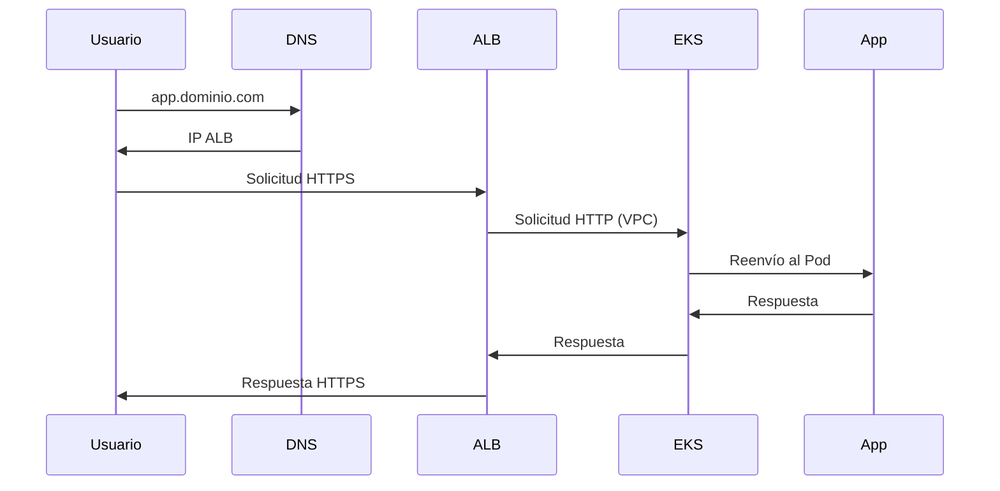

import TroubleshootingItem from "@site/src/components/HomepageFeatures/troubleshootingitem";

# Diagramas de Arquitectura de Infraestructura

**Fecha:** 19 de diciembre de 2024  
**Categoría:** General  
**Etiquetas:** Arquitectura, Infraestructura, Diagramas, Redes, VPC

## Descripción del Problema

**Contexto:** Los usuarios necesitan entender la arquitectura de infraestructura creada por SleakOps al desplegar aplicaciones, incluyendo cómo fluye la solicitud desde los usuarios hasta las aplicaciones y la relación entre los diferentes componentes.

**Síntomas Observados:**

- Falta de diagramas detallados de la arquitectura de infraestructura
- Dificultad para entender el flujo de solicitudes desde el navegador hasta la aplicación
- Relaciones poco claras entre componentes dentro de la VPC
- Diagramas genéricos que no muestran detalles reales de los componentes

**Configuración Relevante:**

- Aplicaciones desplegadas con SleakOps
- Balanceadores de carga y configuración DNS
- VPC y componentes de red
- Múltiples despliegues de aplicaciones

**Condiciones de Error:**

- Falta de documentación arquitectónica detallada
- Representación visual inadecuada de los componentes de infraestructura
- Límites poco claros entre componentes internos y externos

## Solución Detallada

<TroubleshootingItem id="architecture-overview" summary="Resumen de la Arquitectura de Infraestructura de SleakOps">

SleakOps crea una arquitectura de infraestructura completa al desplegar aplicaciones. Aquí está la arquitectura típica:

```
┌─────────────────────────────────────────────────────────────────┐
│                        Internet                                 │
└─────────────────────┬───────────────────────────────────────────┘
                      │
┌─────────────────────┴───────────────────────────────────────────┐
│                    DNS (Route 53)                              │
│  ┌─────────────────────────────────────────────────────────┐    │
│  │  app1.tudominio.com → ALB                              │    │
│  │  app2.tudominio.com → ALB                              │    │
│  └─────────────────────────────────────────────────────────┘    │
└─────────────────────┬───────────────────────────────────────────┘
                      │
┌─────────────────────┴───────────────────────────────────────────┐
│                Balanceador de Carga de Aplicación (ALB)          │
│  ┌─────────────────────────────────────────────────────────┐    │
│  │  Terminación SSL                                       │    │
│  │  Enrutamiento basado en ruta                            │    │
│  │  Comprobaciones de estado                              │    │
│  └─────────────────────────────────────────────────────────┘    │
└─────────────────────┬───────────────────────────────────────────┘
                      │
┌─────────────────────┴───────────────────────────────────────────┐
│                        VPC                                      │
│  ┌─────────────────────────────────────────────────────────┐    │
│  │              Clúster EKS                               │    │
│  │  ┌─────────────────┐  ┌─────────────────┐              │    │
│  │  │   Grupo de Nodos 1│  │   Grupo de Nodos 2│              │    │
│  │  │  ┌───────────┐  │  │  ┌───────────┐  │              │    │
│  │  │  │   Pod 1   │  │  │  │   Pod 3   │  │              │    │
│  │  │  │   Pod 2   │  │  │  │   Pod 4   │  │              │    │
│  │  │  └───────────┘  │  │  └───────────┘  │              │    │
│  │  └─────────────────┘  └─────────────────┘              │    │
│  └─────────────────────────────────────────────────────────┘    │
└─────────────────────────────────────────────────────────────────┘
```

</TroubleshootingItem>

<TroubleshootingItem id="request-flow" summary="Flujo de Solicitudes desde el Navegador hasta la Aplicación">

Así es como fluye una solicitud de usuario a través de la infraestructura de SleakOps:

**1. Resolución DNS**

- El usuario ingresa `app.tudominio.com` en el navegador
- DNS (Route 53) resuelve a la IP del Balanceador de Carga de Aplicación

**2. Procesamiento del Balanceador de Carga**

- La solicitud llega al ALB (fuera de la VPC)
- La terminación SSL ocurre en el ALB
- El ALB realiza comprobaciones de estado en los objetivos
- Enruta la solicitud basándose en reglas de ruta/host

**3. Entrada a la VPC**

- La solicitud entra a la VPC a través de los grupos de destino del ALB
- El tráfico fluye hacia los nodos del clúster EKS

**4. Procesamiento en Kubernetes**

- La solicitud llega al Servicio de Kubernetes
- El Servicio balancea la carga hacia Pods saludables
- La aplicación procesa la solicitud

**5. Ruta de Respuesta**

- La aplicación envía la respuesta de vuelta por la misma ruta
- El ALB maneja la encriptación SSL para la respuesta
- La respuesta llega al navegador del usuario



</TroubleshootingItem>

<TroubleshootingItem id="component-details" summary="Desglose Detallado de Componentes">

**Fuera de la VPC:**

- **DNS Route 53**: Resolución de nombres de dominio
- **Balanceador de Carga de Aplicación**: Terminación SSL, enrutamiento, comprobaciones de estado
- **Puerta de enlace a Internet**: Acceso a Internet de la VPC

**Dentro de la VPC:**

- **Clúster EKS**: Plano de control de Kubernetes gestionado
- **Grupos de Nodos**: Instancias EC2 ejecutando nodos Kubernetes
- **Pods**: Contenedores de aplicaciones
- **Servicios**: Balanceo de carga de Kubernetes
- **Controladores Ingress**: Dirigen el tráfico externo a los servicios

**Componentes de Red:**

- **Subredes Públicas**: ALB y puertas de enlace NAT
- **Subredes Privadas**: Nodos EKS y Pods
- **Grupos de Seguridad**: Reglas de firewall
- **NACLs**: Control de acceso a nivel de subred

**Almacenamiento y Datos:**

- **Volúmenes EBS**: Almacenamiento persistente para Pods
- **RDS/Base de Datos**: Si está configurado
- **Buckets S3**: Almacenamiento de objetos

</TroubleshootingItem>

<TroubleshootingItem id="multi-app-architecture" summary="Arquitectura para Múltiples Aplicaciones">

Al desplegar múltiples aplicaciones con SleakOps, la arquitectura se expande para manejar múltiples servicios:

```
┌─────────────────────────────────────────────────────────────────┐
│                        Internet                                 │
└─────────────────────┬───────────────────────────────────────────┘
                      │
┌─────────────────────┴───────────────────────────────────────────┐
│                    DNS (Route 53)                              │
│  ┌─────────────────────────────────────────────────────────┐    │
│  │  app1.tudominio.com → ALB-1                            │    │
│  │  app2.tudominio.com → ALB-2                            │    │
│  │  api.tudominio.com  → ALB-1 (path-based routing)       │    │
│  └─────────────────────────────────────────────────────────┘    │
└─────────────────────┬───────────────────────────────────────────┘
                      │
┌─────────────────────┴───────────────────────────────────────────┐
│              Múltiples Balanceadores de Carga                   │
│  ┌─────────────────┐  ┌─────────────────┐                      │
│  │      ALB-1      │  │      ALB-2      │                      │
│  │  ┌───────────┐  │  │  ┌───────────┐  │                      │
│  │  │ SSL/TLS   │  │  │  │ SSL/TLS   │  │                      │
│  │  │ Routing   │  │  │  │ Routing   │  │                      │
│  │  └───────────┘  │  │  └───────────┘  │                      │
│  └─────────────────┘  └─────────────────┘                      │
└─────────────────────┬───────────────────────────────────────────┘
                      │
┌─────────────────────┴───────────────────────────────────────────┐
│                        VPC                                      │
│  ┌─────────────────────────────────────────────────────────┐    │
│  │              Clúster EKS                               │    │
│  │  ┌─────────────────┐  ┌─────────────────┐              │    │
│  │  │   Namespace 1   │  │   Namespace 2   │              │    │
│  │  │  ┌───────────┐  │  │  ┌───────────┐  │              │    │
│  │  │  │   App 1   │  │  │  │   App 2   │  │              │    │
│  │  │  │   Pods    │  │  │  │   Pods    │  │              │    │
│  │  │  └───────────┘  │  │  └───────────┘  │              │    │
│  │  └─────────────────┘  └─────────────────┘              │    │
│  │  ┌─────────────────────────────────────────────────────┐    │
│  │  │              Servicios Compartidos                  │    │
│  │  │  ┌───────────┐  ┌───────────┐  ┌───────────┐        │    │
│  │  │  │    RDS    │  │   Redis   │  │    S3     │        │    │
│  │  │  └───────────┘  └───────────┘  └───────────┘        │    │
│  │  └─────────────────────────────────────────────────────┘    │
│  └─────────────────────────────────────────────────────────┘    │
└─────────────────────────────────────────────────────────────────┘
```

**Características de la arquitectura multi-aplicación:**

- **Aislamiento por Namespace**: Cada aplicación en su propio namespace
- **Balanceadores de carga dedicados**: ALBs separados para diferentes aplicaciones
- **Enrutamiento inteligente**: Basado en host y path
- **Servicios compartidos**: Base de datos y caché compartidos entre aplicaciones

</TroubleshootingItem>

<TroubleshootingItem id="network-security-architecture" summary="Arquitectura de Seguridad de Red">

SleakOps implementa múltiples capas de seguridad en la arquitectura de red:

```
┌─────────────────────────────────────────────────────────────────┐
│                    Capa de Seguridad                           │
│  ┌─────────────────────────────────────────────────────────┐    │
│  │                  WAF (Web Application Firewall)         │    │
│  │  ┌───────────────────────────────────────────────────┐  │    │
│  │  │  • Protección DDoS                               │  │    │
│  │  │  • Filtrado de SQL Injection                     │  │    │
│  │  │  • Bloqueo de IPs maliciosas                     │  │    │
│  │  └───────────────────────────────────────────────────┘  │    │
│  └─────────────────────────────────────────────────────────┘    │
└─────────────────────┬───────────────────────────────────────────┘
                      │
┌─────────────────────┴───────────────────────────────────────────┐
│                Balanceador de Carga (ALB)                       │
│  ┌─────────────────────────────────────────────────────────┐    │
│  │  • Certificados SSL/TLS automáticos                    │    │
│  │  • Terminación SSL                                     │    │
│  │  • Redirección HTTP → HTTPS                            │    │
│  └─────────────────────────────────────────────────────────┘    │
└─────────────────────┬───────────────────────────────────────────┘
                      │
┌─────────────────────┴───────────────────────────────────────────┐
│                        VPC                                      │
│  ┌─────────────────────────────────────────────────────────┐    │
│  │              Grupos de Seguridad                       │    │
│  │  ┌─────────────────┐  ┌─────────────────┐              │    │
│  │  │   ALB → EKS     │  │  EKS → RDS      │              │    │
│  │  │   Puerto 80/443 │  │  Puerto 5432    │              │    │
│  │  └─────────────────┘  └─────────────────┘              │    │
│  └─────────────────────────────────────────────────────────┘    │
│  ┌─────────────────────────────────────────────────────────┐    │
│  │                  Subredes                              │    │
│  │  ┌─────────────────┐  ┌─────────────────┐              │    │
│  │  │   Públicas      │  │    Privadas     │              │    │
│  │  │   • ALB         │  │   • EKS Nodes   │              │    │
│  │  │   • NAT Gateway │  │   • RDS         │              │    │
│  │  └─────────────────┘  └─────────────────┘              │    │
│  └─────────────────────────────────────────────────────────┘    │
│  ┌─────────────────────────────────────────────────────────┐    │
│  │              Network ACLs                              │    │
│  │  • Control de acceso a nivel de subred                 │    │
│  │  • Reglas de entrada y salida                          │    │
│  └─────────────────────────────────────────────────────────┘    │
└─────────────────────────────────────────────────────────────────┘
```

</TroubleshootingItem>

<TroubleshootingItem id="data-flow-architecture" summary="Arquitectura de Flujo de Datos">

Comprende cómo fluyen los datos a través de la infraestructura de SleakOps:

```
┌─────────────────────────────────────────────────────────────────┐
│                    Flujo de Datos                              │
│                                                                 │
│  Usuario → ALB → EKS → Aplicación → Base de Datos              │
│                                                                 │
│  ┌─────────────────────────────────────────────────────────┐    │
│  │                  Capa de Aplicación                     │    │
│  │  ┌───────────────┐  ┌───────────────┐                  │    │
│  │  │   Frontend    │  │   Backend     │                  │    │
│  │  │   (React)     │  │   (Django)    │                  │    │
│  │  └───────────────┘  └───────────────┘                  │    │
│  └─────────────────────────────────────────────────────────┘    │
│                           │                                     │
│  ┌─────────────────────────┴───────────────────────────────┐    │
│  │                  Capa de Datos                         │    │
│  │  ┌───────────────┐  ┌───────────────┐  ┌─────────────┐ │    │
│  │  │   PostgreSQL  │  │     Redis     │  │     S3      │ │    │
│  │  │   (Principal) │  │    (Caché)    │  │ (Archivos)  │ │    │
│  │  └───────────────┘  └───────────────┘  └─────────────┘ │    │
│  └─────────────────────────────────────────────────────────┘    │
│                                                                 │
│  ┌─────────────────────────────────────────────────────────┐    │
│  │                Capa de Monitoreo                       │    │
│  │  ┌───────────────┐  ┌───────────────┐                  │    │
│  │  │   CloudWatch  │  │   Prometheus  │                  │    │
│  │  │   (Métricas)  │  │   (Métricas)  │                  │    │
│  │  └───────────────┘  └───────────────┘                  │    │
│  └─────────────────────────────────────────────────────────┘    │
└─────────────────────────────────────────────────────────────────┘
```

**Patrones de flujo de datos:**

1. **Lectura**: Usuario → ALB → EKS → App → Caché/DB → Respuesta
2. **Escritura**: Usuario → ALB → EKS → App → DB → Confirmación
3. **Archivos**: Usuario → ALB → EKS → App → S3 → URL firmada
4. **Logs**: App → CloudWatch/Prometheus → Dashboard

</TroubleshootingItem>

<TroubleshootingItem id="scaling-architecture" summary="Arquitectura de Escalabilidad">

SleakOps implementa escalabilidad automática en múltiples niveles:

```
┌─────────────────────────────────────────────────────────────────┐
│                  Escalabilidad Horizontal                       │
│                                                                 │
│  ┌─────────────────────────────────────────────────────────┐    │
│  │              Nivel de Aplicación                       │    │
│  │                                                         │    │
│  │  Baja carga:    [Pod] [Pod]                            │    │
│  │  Media carga:   [Pod] [Pod] [Pod] [Pod]                │    │
│  │  Alta carga:    [Pod] [Pod] [Pod] [Pod] [Pod] [Pod]    │    │
│  │                                                         │    │
│  │  • HPA (Horizontal Pod Autoscaler)                     │    │
│  │  • Basado en CPU, memoria, métricas personalizadas     │    │
│  └─────────────────────────────────────────────────────────┘    │
│                                                                 │
│  ┌─────────────────────────────────────────────────────────┐    │
│  │              Nivel de Infraestructura                  │    │
│  │                                                         │    │
│  │  Baja carga:    [Node1] [Node2]                        │    │
│  │  Media carga:   [Node1] [Node2] [Node3]                │    │
│  │  Alta carga:    [Node1] [Node2] [Node3] [Node4]        │    │
│  │                                                         │    │
│  │  • Cluster Autoscaler                                  │    │
│  │  • Escalado automático de nodos EC2                    │    │
│  └─────────────────────────────────────────────────────────┘    │
│                                                                 │
│  ┌─────────────────────────────────────────────────────────┐    │
│  │              Nivel de Base de Datos                    │    │
│  │                                                         │    │
│  │  • RDS con réplicas de lectura                         │    │
│  │  • Auto Scaling de almacenamiento                      │    │
│  │  • Connection pooling                                  │    │
│  └─────────────────────────────────────────────────────────┘    │
└─────────────────────────────────────────────────────────────────┘
```

</TroubleshootingItem>

<TroubleshootingItem id="disaster-recovery-architecture" summary="Arquitectura de Recuperación ante Desastres">

SleakOps incluye capacidades de recuperación ante desastres:

```
┌─────────────────────────────────────────────────────────────────┐
│                  Región Principal (us-east-1)                   │
│  ┌─────────────────────────────────────────────────────────┐    │
│  │                    VPC Principal                        │    │
│  │  ┌───────────────┐  ┌───────────────┐                  │    │
│  │  │   EKS Cluster │  │   RDS Primary │                  │    │
│  │  │   (Activo)    │  │   (Activo)    │                  │    │
│  │  └───────────────┘  └───────────────┘                  │    │
│  └─────────────────────────────────────────────────────────┘    │
└─────────────────────┬───────────────────────────────────────────┘
                      │ Replicación
                      │ Automática
┌─────────────────────┴───────────────────────────────────────────┐
│                  Región Secundaria (us-west-2)                  │
│  ┌─────────────────────────────────────────────────────────┐    │
│  │                    VPC Secundaria                       │    │
│  │  ┌───────────────┐  ┌───────────────┐                  │    │
│  │  │   EKS Cluster │  │  RDS Replica  │                  │    │
│  │  │   (Standby)   │  │   (Standby)   │                  │    │
│  │  └───────────────┘  └───────────────┘                  │    │
│  └─────────────────────────────────────────────────────────┘    │
└─────────────────────────────────────────────────────────────────┘

┌─────────────────────────────────────────────────────────────────┐
│                    Componentes de Backup                        │
│  ┌─────────────────────────────────────────────────────────┐    │
│  │  • Snapshots automáticos de EBS                        │    │
│  │  • Backups automáticos de RDS                          │    │
│  │  • Replicación cross-region de S3                      │    │
│  │  • Backup de configuraciones de Kubernetes             │    │
│  └─────────────────────────────────────────────────────────┘    │
└─────────────────────────────────────────────────────────────────┘
```

**Características de DR:**

- **RTO (Recovery Time Objective)**: < 15 minutos
- **RPO (Recovery Point Objective)**: < 5 minutos
- **Failover automático**: Configurado para servicios críticos
- **Backups incrementales**: Cada 6 horas

</TroubleshootingItem>

<TroubleshootingItem id="monitoring-architecture" summary="Arquitectura de Monitoreo y Observabilidad">

Sistema completo de monitoreo implementado por SleakOps:

```
┌─────────────────────────────────────────────────────────────────┐
│                    Capa de Recolección                         │
│  ┌─────────────────────────────────────────────────────────┐    │
│  │              Métricas de Aplicación                    │    │
│  │  ┌───────────────┐  ┌───────────────┐                  │    │
│  │  │   Prometheus  │  │   CloudWatch  │                  │    │
│  │  │   (Custom)    │  │   (AWS)       │                  │    │
│  │  └───────────────┘  └───────────────┘                  │    │
│  └─────────────────────────────────────────────────────────┘    │
│                                                                 │
│  ┌─────────────────────────────────────────────────────────┐    │
│  │                  Logs                                  │    │
│  │  ┌───────────────┐  ┌───────────────┐                  │    │
│  │  │   Fluentd     │  │  CloudWatch   │                  │    │
│  │  │   (Collector) │  │   Logs        │                  │    │
│  │  └───────────────┘  └───────────────┘                  │    │
│  └─────────────────────────────────────────────────────────┘    │
│                                                                 │
│  ┌─────────────────────────────────────────────────────────┐    │
│  │                 Trazas                                 │    │
│  │  ┌───────────────┐  ┌───────────────┐                  │    │
│  │  │    Jaeger     │  │   X-Ray       │                  │    │
│  │  │   (Tracing)   │  │   (AWS)       │                  │    │
│  │  └───────────────┘  └───────────────┘                  │    │
│  └─────────────────────────────────────────────────────────┘    │
└─────────────────────┬───────────────────────────────────────────┘
                      │
┌─────────────────────┴───────────────────────────────────────────┐
│                    Capa de Visualización                       │
│  ┌─────────────────────────────────────────────────────────┐    │
│  │  ┌───────────────┐  ┌───────────────┐  ┌─────────────┐  │    │
│  │  │    Grafana    │  │   CloudWatch  │  │   SleakOps  │  │    │
│  │  │  (Dashboards) │  │  (Dashboards) │  │  (Console)  │  │    │
│  │  └───────────────┘  └───────────────┘  └─────────────┘  │    │
│  └─────────────────────────────────────────────────────────┘    │
└─────────────────────┬───────────────────────────────────────────┘
                      │
┌─────────────────────┴───────────────────────────────────────────┐
│                    Capa de Alertas                             │
│  ┌─────────────────────────────────────────────────────────┐    │
│  │  ┌───────────────┐  ┌───────────────┐  ┌─────────────┐  │    │
│  │  │  AlertManager │  │      SNS      │  │    Slack    │  │    │
│  │  │  (Prometheus) │  │     (AWS)     │  │ (Webhook)   │  │    │
│  │  └───────────────┘  └───────────────┘  └─────────────┘  │    │
│  └─────────────────────────────────────────────────────────┘    │
└─────────────────────────────────────────────────────────────────┘
```

</TroubleshootingItem>

<TroubleshootingItem id="cost-optimization-architecture" summary="Arquitectura de Optimización de Costos">

SleakOps implementa estrategias de optimización de costos:

```
┌─────────────────────────────────────────────────────────────────┐
│                  Optimización de Compute                        │
│  ┌─────────────────────────────────────────────────────────┐    │
│  │              Instancias Spot                           │    │
│  │  • 70% de descuento en instancias EC2                  │    │
│  │  • Manejo automático de interrupciones                 │    │
│  │  • Mix de On-Demand y Spot                             │    │
│  └─────────────────────────────────────────────────────────┘    │
│                                                                 │
│  ┌─────────────────────────────────────────────────────────┐    │
│  │              Auto Scaling                              │    │
│  │  • Escalado basado en demanda                          │    │
│  │  • Apagado automático en horarios no laborales        │    │
│  │  • Escalado predictivo                                 │    │
│  └─────────────────────────────────────────────────────────┘    │
└─────────────────────────────────────────────────────────────────┘

┌─────────────────────────────────────────────────────────────────┐
│                  Optimización de Almacenamiento                 │
│  ┌─────────────────────────────────────────────────────────┐    │
│  │              Tiering Inteligente                       │    │
│  │  • S3 Intelligent Tiering                              │    │
│  │  • Lifecycle policies automáticas                      │    │
│  │  • Compresión de logs                                  │    │
│  └─────────────────────────────────────────────────────────┘    │
└─────────────────────────────────────────────────────────────────┘

┌─────────────────────────────────────────────────────────────────┐
│                  Optimización de Red                           │
│  ┌─────────────────────────────────────────────────────────┐    │
│  │              CDN y Caché                               │    │
│  │  • CloudFront para contenido estático                  │    │
│  │  • Redis para caché de aplicación                      │    │
│  │  • Compresión gzip automática                          │    │
│  └─────────────────────────────────────────────────────────┘    │
└─────────────────────────────────────────────────────────────────┘
```

**Ahorros típicos:**

- **Instancias Spot**: 60-70% de ahorro en compute
- **Auto Scaling**: 30-40% de ahorro en recursos no utilizados
- **S3 Intelligent Tiering**: 20-30% de ahorro en almacenamiento
- **CDN**: 40-50% de ahorro en transferencia de datos

</TroubleshootingItem>

---

_Esta sección de preguntas frecuentes fue generada automáticamente el 19 de diciembre de 2024 basada en una consulta real de usuario._
