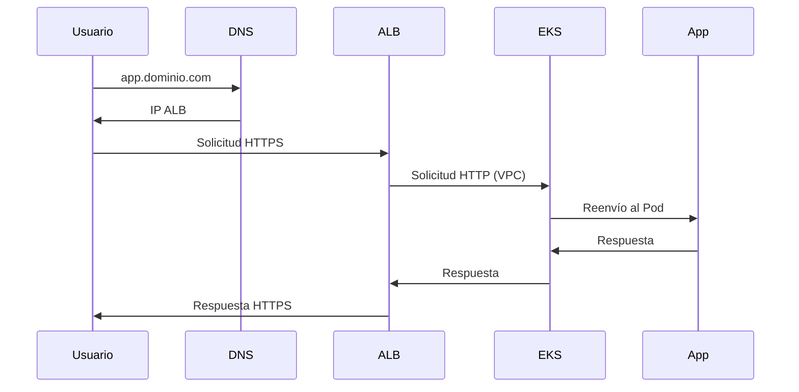

import TroubleshootingItem from "@site/src/components/HomepageFeatures/troubleshootingitem";

# Diagramas de Arquitectura de Infraestructura

**Fecha:** 19 de diciembre de 2024  
**Categoría:** General  
**Etiquetas:** Arquitectura, Infraestructura, Diagramas, Redes, VPC

## Descripción del Problema

**Contexto:** Los usuarios necesitan entender la arquitectura de infraestructura creada por SleakOps al desplegar aplicaciones, incluyendo cómo fluye la solicitud desde los usuarios hasta las aplicaciones y la relación entre los diferentes componentes.

**Síntomas Observados:**

- Falta de diagramas detallados de la arquitectura de infraestructura
- Dificultad para entender el flujo de solicitudes desde el navegador hasta la aplicación
- Relaciones poco claras entre componentes dentro de la VPC
- Diagramas genéricos que no muestran detalles reales de los componentes

**Configuración Relevante:**

- Aplicaciones desplegadas con SleakOps
- Balanceadores de carga y configuración DNS
- VPC y componentes de red
- Múltiples despliegues de aplicaciones

**Condiciones de Error:**

- Falta de documentación arquitectónica detallada
- Representación visual inadecuada de los componentes de infraestructura
- Límites poco claros entre componentes internos y externos

## Solución Detallada

<TroubleshootingItem id="architecture-overview" summary="Resumen de la Arquitectura de Infraestructura de SleakOps">

SleakOps crea una arquitectura de infraestructura completa al desplegar aplicaciones. Aquí está la arquitectura típica:

```
┌─────────────────────────────────────────────────────────────────┐
│                        Internet                                 │
└─────────────────────┬───────────────────────────────────────────┘
                      │
┌─────────────────────┴───────────────────────────────────────────┐
│                    DNS (Route 53)                              │
│  ┌─────────────────────────────────────────────────────────┐    │
│  │  app1.tudominio.com → ALB                              │    │
│  │  app2.tudominio.com → ALB                              │    │
│  └─────────────────────────────────────────────────────────┘    │
└─────────────────────┬───────────────────────────────────────────┘
                      │
┌─────────────────────┴───────────────────────────────────────────┐
│                Balanceador de Carga de Aplicación (ALB)          │
│  ┌─────────────────────────────────────────────────────────┐    │
│  │  Terminación SSL                                       │    │
│  │  Enrutamiento basado en ruta                            │    │
│  │  Comprobaciones de estado                              │    │
│  └─────────────────────────────────────────────────────────┘    │
└─────────────────────┬───────────────────────────────────────────┘
                      │
┌─────────────────────┴───────────────────────────────────────────┐
│                        VPC                                      │
│  ┌─────────────────────────────────────────────────────────┐    │
│  │              Clúster EKS                               │    │
│  │  ┌─────────────────┐  ┌─────────────────┐              │    │
│  │  │   Grupo de Nodos 1│  │   Grupo de Nodos 2│              │    │
│  │  │  ┌───────────┐  │  │  ┌───────────┐  │              │    │
│  │  │  │   Pod 1   │  │  │  │   Pod 3   │  │              │    │
│  │  │  │   Pod 2   │  │  │  │   Pod 4   │  │              │    │
│  │  │  └───────────┘  │  │  └───────────┘  │              │    │
│  │  └─────────────────┘  └─────────────────┘              │    │
│  └─────────────────────────────────────────────────────────┘    │
└─────────────────────────────────────────────────────────────────┘
```

</TroubleshootingItem>

<TroubleshootingItem id="request-flow" summary="Flujo de Solicitudes desde el Navegador hasta la Aplicación">

Así es como fluye una solicitud de usuario a través de la infraestructura de SleakOps:

**1. Resolución DNS**

- El usuario ingresa `app.tudominio.com` en el navegador
- DNS (Route 53) resuelve a la IP del Balanceador de Carga de Aplicación

**2. Procesamiento del Balanceador de Carga**

- La solicitud llega al ALB (fuera de la VPC)
- La terminación SSL ocurre en el ALB
- El ALB realiza comprobaciones de estado en los objetivos
- Enruta la solicitud basándose en reglas de ruta/host

**3. Entrada a la VPC**

- La solicitud entra a la VPC a través de los grupos de destino del ALB
- El tráfico fluye hacia los nodos del clúster EKS

**4. Procesamiento en Kubernetes**

- La solicitud llega al Servicio de Kubernetes
- El Servicio balancea la carga hacia Pods saludables
- La aplicación procesa la solicitud

**5. Ruta de Respuesta**

- La aplicación envía la respuesta de vuelta por la misma ruta
- El ALB maneja la encriptación SSL para la respuesta
- La respuesta llega al navegador del usuario



</TroubleshootingItem>

<TroubleshootingItem id="component-details" summary="Desglose Detallado de Componentes">

**Fuera de la VPC:**

- **DNS Route 53**: Resolución de nombres de dominio
- **Balanceador de Carga de Aplicación**: Terminación SSL, enrutamiento, comprobaciones de estado
- **Puerta de enlace a Internet**: Acceso a Internet de la VPC

**Dentro de la VPC:**

- **Clúster EKS**: Plano de control de Kubernetes gestionado
- **Grupos de Nodos**: Instancias EC2 ejecutando nodos Kubernetes
- **Pods**: Contenedores de aplicaciones
- **Servicios**: Balanceo de carga de Kubernetes
- **Controladores Ingress**: Dirigen el tráfico externo a los servicios

**Componentes de Red:**

- **Subredes Públicas**: ALB y puertas de enlace NAT
- **Subredes Privadas**: Nodos EKS y Pods
- **Grupos de Seguridad**: Reglas de firewall
- **NACLs**: Control de acceso a nivel de subred

**Almacenamiento y Datos:**

- **Volúmenes EBS**: Almacenamiento persistente para Pods
- **RDS/Base de Datos**: Si está configurado
- **Buckets S3**: Almacenamiento de objetos

</TroubleshootingItem>

<TroubleshootingItem id="multi-app-architecture" summary="Arquitectura para Múltiples Aplicaciones">

Al desplegar múltiples aplicaciones
